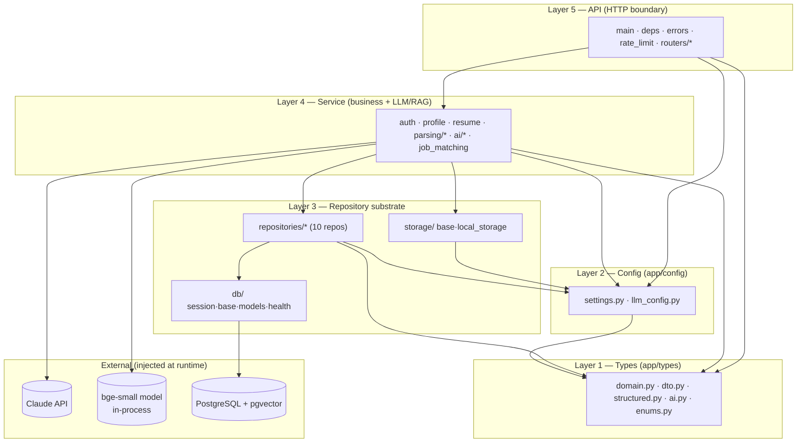
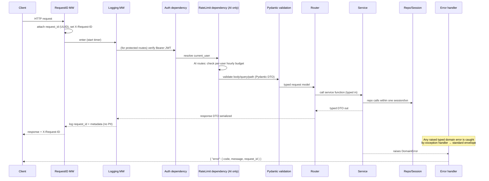

# Backend Architecture — AI Professional Network (MVP)

**Project:** ai-professional-network
**Version:** 1.0 (MVP)
**Status:** Production-grade design. Consistent with the canonical contracts:
`data-models.md`, `api-contracts.md`, `folder-structure.md`, `component-map.md`.
**Stack:** Python 3.12 · FastAPI · uv · ruff · mypy · pytest · PostgreSQL + pgvector ·
Claude (Anthropic) · local `BAAI/bge-small-en-v1.5` embeddings (384-dim).
**Date:** 2026-06-30

This document describes *how* the backend is structured and behaves. It does not introduce
new entities, fields, or endpoints — those are owned by `data-models.md` and
`api-contracts.md`. Security concerns are detailed in the companion `security-architecture.md`.

---

## 1. Layer model and the one-way dependency rule

The backend uses a strict, one-directional layered architecture. Each layer may import only
from layers *below* it. There are **no upward imports and no sideways imports across siblings
that would create a cycle**. LLM/RAG logic exists **only** in the service layer.

```
Types  →  Config  →  Repository (db + repositories + storage)  →  Service  →  API  →  (UI)
```

- **Types** depend on nothing internal (only stdlib + Pydantic).
- **Config** depends on Types.
- **Repository** (and the `db/` and `storage/` substrates) depend on Types + Config.
- **Service** depends on Types + Config + Repository + Storage. *All Claude and embedding
  calls happen here.*
- **API** depends on all of the above and wires HTTP. It contains **no business logic** —
  routers translate HTTP ↔ service calls.
- **UI** (frontend, separate package) consumes the API over HTTP only.

### 1.1 Layer boundary diagram



**Enforcement (lint-time, CI gate):**
- `mypy --strict` over `app/types/` and ideally the whole package.
- An import-linter contract (or a small custom AST check in CI) forbidding back-edges:
  `types` may not import `config/repositories/services/api`; `repositories` may not import
  `services/api`; `services` may not import `api`. This is a hard CI failure, not a guideline.

### 1.2 What each layer may import

| Layer | May import | May NOT import |
|-------|-----------|----------------|
| `types/` | stdlib, `pydantic` | anything in `app/` except other `types/` modules |
| `config/` | `types/`, `pydantic-settings` | `db/`, `repositories/`, `services/`, `api/` |
| `db/` + `repositories/` + `storage/` | `types/`, `config/`, SQLAlchemy, pgvector | `services/`, `api/` |
| `services/` | `types/`, `config/`, `repositories/`, `storage/`, Claude SDK, sentence-transformers | `api/` |
| `api/` | everything below | (it is the top — nothing imports it) |

---

## 2. Module breakdown per layer

Paths are under `backend/src/app/` (shown as `app/`), exactly as in `folder-structure.md`.

### 2.1 Types (`app/types/`) — Layer 1
- `domain.py` — internal entity models (`User`, `Profile`, `Resume`, `Job`, `RefreshToken`,
  `ResumeReview`, `ProfileOptimization`, `JobMatchRun`, `JobMatch`, `KnowledgeChunk`,
  `AIRequestLog`) mirroring `data-models.md` §2.
- `dto.py` — request/response DTOs from `api-contracts.md` (e.g. `RegisterRequest`,
  `AuthSessionResponse`, `ProfileResponse`, `ResumeResponse`, `ResumeReviewResponse`,
  `JobMatchResponse`, the `error.{code,message,request_id}` envelope). DTOs **never** carry
  `password_hash`, `token_hash`, `storage_key`, or raw `embedding`.
- `structured.py` — `StructuredResume`, `ContactInfo`, `EducationItem`, `ExperienceItem`,
  `CertificationItem`, `ProjectItem`, `ReviewItem`, `Citation` (data-models §3).
- `ai.py` — `ResumeReviewContent`, `ProfileOptimizationContent` (the JSON schemas that
  Claude outputs must validate against).
- `enums.py` — `ThemePreference`, `ParseStatus`, `ReviewStatus`, `AIFeature`, `AIOutcome`,
  `KnowledgeCategory`, mime-type constants — value sets from data-models §0.

### 2.2 Config (`app/config/`) — Layer 2
- `settings.py` — a single `Settings(BaseSettings)` (pydantic-settings) read from env, with
  **fail-fast validation** at startup. Surfaces DB URL, JWT secret/lifetimes, Argon2 params,
  CORS origins, upload limit, AI rate limit, storage path, etc. (full env list in §8).
- `llm_config.py` — centralized LLM config: model ids (`claude-opus-4-8` for review,
  `claude-sonnet-4-6` for optimization/matching/structuring per the contracts), `max_tokens`
  budgets per feature, the 60 s timeout, retry count (1), and the provider switch. **This is
  the single place model/provider/token decisions live** (E6-S1 AC5).

### 2.3 Repository substrate (`app/db/`, `app/repositories/`, `app/storage/`) — Layer 3
- `db/session.py` — SQLAlchemy engine + session factory; the **only** module that creates
  sessions. Exposes a `get_session()` generator consumed by DI.
- `db/base.py` — declarative base + metadata (Alembic target).
- `db/models.py` — ORM tables incl. `Vector(384)` (pgvector) columns and HNSW vector indexes.
- `db/health.py` — `SELECT 1` readiness probe used by `/health`.
- `repositories/*` — one module per aggregate (`user`, `refresh_token`, `profile`, `resume`,
  `knowledge`, `job`, `resume_review`, `profile_optimization`, `job_match`, `ai_log`). Pure
  data access: **no HTTP, no business rules, no Claude/embedding calls.** Repositories accept
  a session and typed inputs and return typed domain objects.
- `storage/base.py` — `StorageBackend` protocol (`save`, `read`, `delete`).
- `storage/local_storage.py` — non-web-served local-volume implementation for MVP; resume
  bytes never enter the DB and never sit under a static route.

### 2.4 Service (`app/services/`) — Layer 4 (business + LLM/RAG)
- `auth_service.py` — register/login/refresh/logout orchestration.
- `security.py` — Argon2 hashing + JWT encode/decode helpers (detailed in security doc).
- `profile_service.py` — view/edit, skill trim+dedupe, `completion_percentage`,
  `incomplete_sections`.
- `resume_service.py` — upload policy enforcement + hybrid-parse orchestration.
- `parsing/extractor.py` — deterministic pypdf/python-docx text extraction.
- `parsing/structurer.py` — LLM normalization to `StructuredResume` (untrusted-text handling).
- `ai/claude_client.py` — the **only** gateway to Claude: `complete_structured(prompt, schema)`,
  streaming mode, single retry, timeout, metadata-only logging (E6-S1).
- `ai/embedding_provider.py` — `EmbeddingProvider` interface + lazy bge-small singleton (384-dim).
- `ai/rag_retrieval.py` — `retrieve(query, k)` → context block + `Citation`s (no LLM call).
- `ai/kb_ingestion.py` — chunk + embed + idempotent KB indexing.
- `ai/resume_review_service.py` — RAG-grounded review, streaming, hash cache.
- `ai/profile_optimization_service.py` — RAG-grounded profile suggestions.
- `ai/prompts/` — versioned, system-instruction-first prompt templates.
- `job_matching_service.py` — embed resume → pgvector top-10 → Claude re-rank → `JobMatch`.

Each service function maps **1:1 to an endpoint** and takes typed inputs / returns typed DTOs
with no HTTP coupling, preserving Option-C (agent) readiness (api-contracts §8).

### 2.5 API (`app/api/`) — Layer 5
- `main.py` — app factory; mounts routers under `/api/v1`; registers middleware (§4) and
  exception handlers; wires DI providers.
- `deps.py` — `get_session`, `get_current_user`, and provider getters
  (`get_claude_client`, `get_embedding_provider`, repository/service factories).
- `errors.py` — exception handlers mapping typed domain errors → the standard error envelope.
- `rate_limit.py` — per-user AI rate-limit dependency/middleware (10/hr/user, configurable).
- `routers/{health,auth,profile,resume,ai,jobs}.py` — thin HTTP handlers; validate via
  Pydantic, call a service, serialize a response DTO.

### 2.6 Middleware (`app/api/main.py` + `app/api/rate_limit.py` + `errors.py`)
Cross-cutting concerns — request-id, auth context, rate limiting, error envelope, logging —
are middleware/dependencies, not business code. Order is specified in §4.

---

## 3. Dependency injection strategy

DI is FastAPI `Depends` end-to-end. Wiring flows downward only; nothing is instantiated by a
lower layer reaching up.

### 3.1 Session management
- `db/session.py` owns the engine and a `sessionmaker`.
- `deps.get_session()` is a generator dependency: it yields a session and guarantees
  `commit` on success / `rollback` on exception / `close` in `finally`. **One session per
  request.** Repositories receive this session via the service that depends on them.
- Repositories never open their own sessions; this keeps transaction boundaries (§9) in the
  service/request scope.

### 3.2 Provider injection (the two expensive/external dependencies)
- **EmbeddingProvider** — `ai/embedding_provider.py` exposes a lazily-initialized singleton
  (the bge-small model is loaded once per process, not per request). `deps.get_embedding_provider()`
  returns the singleton. Behind the `EmbeddingProvider` protocol so a remote provider can be
  swapped later (BRD open question 2) without touching services.
- **Claude client** — `ai/claude_client.py` is constructed from `llm_config` at startup and
  injected via `deps.get_claude_client()`. Services depend on the **interface**, never the
  Anthropic SDK directly, so the provider switch in `llm_config` is the only change point.

### 3.3 Service injection
Service objects/functions are assembled from injected repositories + providers. A router
declares e.g. `svc: ResumeReviewService = Depends(get_resume_review_service)`, and
`get_resume_review_service` composes the resume repo, review repo, RAG retrieval, Claude
client, and embedding provider. This makes every external boundary a **single injected
seam** that tests replace with fakes (§10).

### 3.4 Override seam for tests
Because everything external is a `Depends` provider, `app.dependency_overrides` swaps the
DB session (test DB), the Claude client (deterministic fake), and the embedding provider
(hash-based fake vectors) in integration tests — no monkeypatching of internals.

---

## 4. Request lifecycle

Middleware executes outermost→innermost on the way in, and unwinds in reverse on the way out.



### 4.1 Middleware / dependency order (outer → inner)
1. **Request-ID** — generate/propagate a UUID `request_id`; set `X-Request-ID` response
   header; bind it into the logging context. This id is the correlation key surfaced in AI
   error bodies and `ai_request_logs.request_id`.
2. **Structured logging** — start a per-request log span (method, path, status, latency,
   request_id, user_id). Never logs bodies/PII (§6).
3. **CORS** — allow only configured origins (security doc §7).
4. **Auth** (dependency on protected routes) — parse `Authorization: Bearer`, verify the
   JWT signature + expiry, load `current_user`. Missing/invalid → `401 unauthorized`.
5. **Rate limit** (dependency on `/ai/*` and `/jobs/match`) — enforce 10/hr/user *before*
   any LLM invocation; on breach return `429` with `Retry-After` and the LLM is **not** called.
6. **Validation** — Pydantic validates path/query/body into typed models; failures yield the
   FastAPI `422` field-level shape (api-contracts §0).
7. **Error handler** (registered exception handlers) — converts typed domain errors to the
   standard envelope; it is the last line so no internal detail escapes.

### 4.2 Validation (Pydantic)
- All request bodies are typed DTOs from `app/types/dto.py`; constraints (email format,
  password ≥ 8, `headline ≤ 160`, `summary ≤ 2000`, pagination bounds) are declared on the
  models. Validation runs before any service code.
- All JSON is **snake_case** on the wire (data-models §0); no camelCase aliasing.

### 4.3 Serialization (response DTOs)
- Routers return response DTOs only. DTOs are the safety boundary that *cannot* express
  `password_hash`, `token_hash`, `storage_key`, or raw `embedding` (those fields are not on
  the DTO models at all — exclusion by construction, not by `exclude=`).
- AI LLM outputs are validated into `ai.py` schemas *before* being placed in a response DTO
  (double containment: schema validation in the service, DTO shaping at the boundary).

---

## 5. Error handling

A small hierarchy of **typed domain errors** is raised by services and repositories; the API
layer owns the *only* mapping to HTTP. Internal exceptions never reach the client verbatim.

### 5.1 Error envelope (matches api-contracts §0)
Non-2xx (except 422) responses use:
```json
{ "error": { "code": "machine_code", "message": "Safe, human-readable.", "request_id": "uuid" } }
```
`request_id` is always present on `/ai/*` and `/jobs/match`. `422` uses FastAPI's field-level
`{"detail":[...]}` shape unchanged.

### 5.2 Domain error → HTTP mapping

| Domain error (service layer) | HTTP | `code` | Notes |
|------------------------------|------|--------|-------|
| `EmailAlreadyRegistered` | 409 | `email_already_registered` | register |
| `InvalidCredentials` | 401 | `invalid_credentials` | login — never reveals if email exists |
| `InvalidRefreshToken` | 401 | `invalid_refresh_token` | revoked/expired/unknown |
| `Unauthorized` (no/invalid access token) | 401 | `unauthorized` | auth dependency |
| `Forbidden` (not owner) | 403 | `forbidden` | resume delete by non-owner |
| `NotFound` (resume/job/review/optimization) | 404 | `*_not_found` | per-resource code |
| `UnsupportedFileType` | 415 | `unsupported_file_type` | stores nothing |
| `FileTooLarge` / `FileUnreadable` | 422 | `file_too_large` / `file_unreadable` | stores nothing |
| `ProfileInsufficient` | 409 | `profile_insufficient` | optimization too-sparse |
| `ResumeNotParsed` | 409 | `resume_not_parsed` | job match precondition |
| `RateLimited` | 429 | `rate_limited` | `Retry-After`; LLM not invoked |
| `AIProviderUnavailable` | 503 | `ai_provider_unavailable` | Claude outage |
| `AITimeout` | 504 | `ai_timeout` | 60 s overrun |

### 5.3 No internal detail leakage
- Handlers map exception *type* → safe `code`/`message`; the original exception message,
  stack trace, SQL, or provider error text is **logged with the request_id, never returned**.
- A catch-all handler converts any unmapped exception to a generic `500 internal_error`
  (safe message) and logs the detail server-side under the request_id.

---

## 6. Logging strategy

- **Structured JSON logs** with a stable schema: `timestamp`, `level`, `request_id`,
  `user_id` (UUID only), `route`, `status`, `latency_ms`, and for AI calls `feature`,
  `model_id`, `outcome`, token counts, `retry_count`.
- **Never logged:** request/response bodies, `users.email`, `profiles.full_name`,
  `resumes.original_filename`, `resumes.structured_content` / any resume or prompt text,
  file bytes, `password_hash`, `token_hash`, raw `embedding`, JWTs, or refresh tokens
  (data-models §4 PII list). The logger has an explicit allow-list of fields; everything else
  is dropped.
- **AI observability** is persisted via `ai_request_logs` (metadata-only) keyed by
  `request_id`, so a failed AI request can be correlated to a log line and a DB row without
  ever storing content. `request_id` is echoed to the client in AI error bodies for support.
- Logs are emitted to stdout (12-factor) for the deploy platform to collect.

---

## 7. Configuration

- **Externalized env vars only.** No literal secrets in code or committed files;
  `backend/.env.example` documents every variable with safe placeholders.
- **Centralized `Settings`** (`config/settings.py`) is the single read point; it validates at
  startup and **fails fast** on missing/invalid required vars (a known failure mode in the BRD:
  misconfiguration). Nothing reads `os.environ` directly outside this module.
- **Centralized LLM config** (`config/llm_config.py`) holds model ids, per-feature
  `max_tokens` budgets, the 60 s timeout, retry count, and the provider switch — enabling
  token-budget tuning and provider/model swaps with **no code change** (E6-S1 AC5).

### 7.1 Core env vars (documented in `.env.example`)
| Var | Purpose |
|-----|---------|
| `DATABASE_URL` | PostgreSQL+pgvector DSN |
| `JWT_SECRET` | HS256 signing secret (access tokens) |
| `JWT_ACCESS_TTL_SECONDS` | default 900 (15 min) |
| `JWT_REFRESH_TTL_SECONDS` | refresh lifetime |
| `ARGON2_TIME_COST` / `ARGON2_MEMORY_KIB` / `ARGON2_PARALLELISM` | hashing params |
| `ANTHROPIC_API_KEY` | Claude API key |
| `LLM_REVIEW_MODEL` / `LLM_DEFAULT_MODEL` | model ids |
| `LLM_TIMEOUT_SECONDS` | default 60 |
| `LLM_MAX_RETRIES` | default 1 |
| `AI_RATE_LIMIT_PER_HOUR` | default 10 |
| `EMBEDDING_MODEL_NAME` | `BAAI/bge-small-en-v1.5` |
| `RESUME_MAX_BYTES` | 5_242_880 |
| `STORAGE_DIR` | local resume volume path |
| `CORS_ALLOWED_ORIGINS` | comma-separated frontend origins |
| `ENV` / `LOG_LEVEL` | runtime env + log verbosity |

---

## 8. Database, migrations, transactions, pgvector

### 8.1 Migrations
- **Alembic** (`alembic.ini`, `migrations/env.py`, `migrations/versions/`). `env.py` loads
  `Settings` for the DSN and points at `db/base.py` metadata.
- The first migration **enables the extension** (`CREATE EXTENSION IF NOT EXISTS vector`)
  before creating `vector(384)` columns, then creates tables, CHECK constraints, unique
  indexes, and the HNSW vector indexes (`resumes_embedding_hnsw`, `jobs_embedding_hnsw`,
  `knowledge_chunks_embedding_hnsw`) per data-models §2.
- All schema changes go through migrations; no runtime `create_all` in production.

### 8.2 Transaction boundaries
- **One transaction per request**, owned by the `get_session` dependency: commit on success,
  rollback on any raised exception. Services compose multiple repository calls inside this
  single unit of work.
- **Atomicity-critical flows** are explicitly single-transaction:
  - Auth refresh rotation — revoke old token + insert new token + set `rotated_to` commit
    together (no window where both/neither exist).
  - Job match run — insert `job_match_runs` row + its `job_matches` children atomically so a
    re-rank set is never partially persisted.
  - Resume replace + cascade delete — handled within one transaction; file removal via the
    storage interface is sequenced so the DB row and file stay consistent.
- Repositories never commit on their own; the boundary stays at request scope.

### 8.3 pgvector usage (repository layer only)
- Vector columns are `vector(384)` (must equal bge-small output; any mismatch is a defect per
  data-models §0).
- Similarity queries live in repositories (`knowledge_repository.top_k`,
  `job_repository.retrieve_top_jobs(k=10)`) using cosine distance against HNSW indexes.
  Services pass an already-computed query embedding *down* to the repository — the embedding
  is produced in the service layer via `EmbeddingProvider`, the *search* runs in the repo.
- Job matching is the canonical two-stage flow: repo returns pgvector top-10 (no LLM) →
  service calls Claude to re-rank with fit/gap (api-contracts §6, E7-S2).

---

## 9. Testing strategy (>80% backend coverage)

Coverage target is enforced in CI (`pytest --cov`, fail under 80% on core modules). Tests are
organized to match the layers (`tests/unit/test_types|test_repositories|test_services`,
`tests/integration/*`) per `folder-structure.md`.

### 9.1 Per-layer unit tests
- **Types** — Pydantic models validate/reject correctly; DTOs cannot serialize forbidden
  fields; `StructuredResume`/AI content schemas accept valid and reject malformed shapes.
- **Repositories** — run against a real Postgres+pgvector test instance (the vector queries
  cannot be faithfully faked); assert CRUD, unique constraints, cache-by-hash lookups, cascade
  deletes, and top-k ordering.
- **Services** — business logic with **mocked boundaries**: Claude client and
  EmbeddingProvider are replaced by deterministic fakes; repositories may be real (against
  test DB) or faked. Cover: completion-percentage algorithm, skill normalization, upload
  policy (size/MIME/extension/empty-extraction/password-protected rejections), single-retry on
  invalid LLM JSON, hash-cache hit/miss, rate-limit decision, fit-score ordering.

### 9.2 Contract tests
- Integration tests assert each endpoint's **request/response shape and status codes match
  `api-contracts.md`** exactly (including the error envelope and 422 field shape), and that
  responses never contain `password_hash`/`token_hash`/`storage_key`/`embedding`.
- A schema-conformance check validates representative responses against
  `api-contracts.schema.json` and stored entities against `data-models.schema.json`, keeping
  code and canonical schemas in lock-step.

### 9.3 Mock boundaries for Claude + embeddings
- **Fake Claude client** returns canned schema-valid JSON, plus error modes (invalid JSON
  once-then-valid to exercise the single retry; timeout; provider-unavailable) — no network,
  deterministic, fast.
- **Fake EmbeddingProvider** returns stable pseudo-vectors (hash-seeded, 384-dim) so vector
  search is reproducible without loading the model.
- Both are injected via `app.dependency_overrides` (§3.4).

### 9.4 Fixtures
- `conftest.py` provides a transactional test DB (rolled back per test), an `httpx`/TestClient
  with overridable deps, and helpers minting valid access tokens.
- File fixtures: `sample_resume.pdf`, `sample_resume.docx`, and `prompt_injection_resume.pdf`
  (the adversarial fixture proving system instructions override in-resume injection, E4-S2 AC5).

### 9.5 Security-relevant test cases (cross-ref security doc)
- Login never reveals email existence; refresh rotation revokes the old token; logout is
  idempotent; non-owner resume delete is rejected; PII never appears in captured log output;
  upload rejections store nothing; injection fixture does not alter structuring output.

---

## 10. Consistency guarantees

- Every endpoint here maps to exactly one operation in `api-contracts.md` §7 (17 operations)
  and one service function (§8 of that doc).
- Every persisted shape derives from `data-models.md`; no new entities/fields are introduced.
- Module paths match `folder-structure.md`; story→module routing matches `component-map.md`.
- The 384-dim embedding invariant, snake_case-on-the-wire rule, PII-never-logged rule, and the
  forbidden-DTO-fields rule are honored throughout and are CI-checked.
