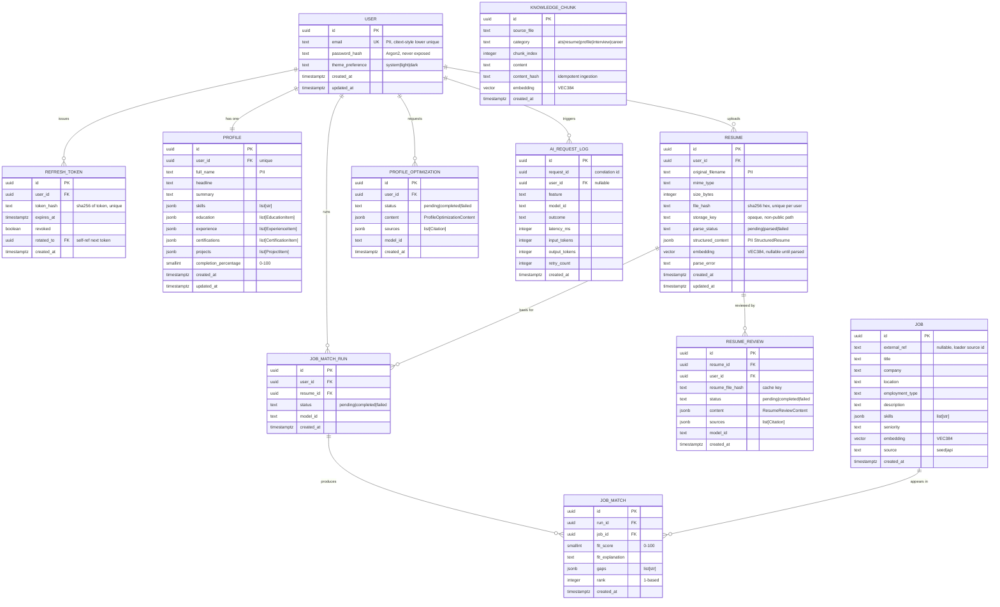

# Data Models — AI Professional Network (MVP)

**Project:** ai-professional-network
**Version:** 1.0 (MVP)
**Status:** Canonical. All other design artifacts reference this file.
**Date:** 2026-06-30

This document is the single source of truth for the persistence schema. The JSON Schema
companion (`data-models.schema.json`) is generated from these definitions and must stay in
lock-step. API DTOs in `api-contracts.md` derive their field names from here.

---

## 0. Conventions

| Concern | Rule |
|---------|------|
| **DB column casing** | `snake_case` (PostgreSQL columns and SQLAlchemy attributes). |
| **JSON / API casing** | `snake_case` everywhere (request and response bodies). Stated explicitly so frontend and backend never disagree. No camelCase on the wire. |
| **Primary keys** | `UUID` v4, generated server-side, column name `id`. |
| **Timestamps** | `TIMESTAMPTZ` (UTC). `created_at` set on insert; `updated_at` set on insert and every update. |
| **Soft fields vs hard delete** | MVP uses hard deletes for resumes + cascaded AI artifacts (privacy requirement). Users are hard-deleted on account deletion. |
| **Embeddings** | `vector(384)` (pgvector). Dimension MUST equal `BAAI/bge-small-en-v1.5` output = **384**. Any mismatch is a defect. |
| **Money/scores** | Fit scores are `SMALLINT` 0–100. Completion percentage is `SMALLINT` 0–100. |
| **Enums** | Stored as `TEXT` with a `CHECK` constraint (portable; avoids native enum migration pain). |
| **PII** | Columns flagged **[PII]** below MUST NEVER appear in logs, AIRequestLog, or error payloads. |
| **Embedding columns** | Flagged **[VEC384]**. |

### Enum value sets

- `theme_preference`: `system` (default), `light`, `dark`
- `resume.parse_status`: `pending`, `parsed`, `failed`
- `resume.mime_type`: `application/pdf`, `application/vnd.openxmlformats-officedocument.wordprocessingml.document`
- `resume_review.status`: `pending`, `completed`, `failed`
- `profile_optimization.status`: `pending`, `completed`, `failed`
- `job_match_run.status`: `pending`, `completed`, `failed`
- `ai_request_log.feature`: `resume_structuring`, `resume_review`, `profile_optimization`, `job_matching`
- `ai_request_log.outcome`: `success`, `retry_success`, `failed`, `timeout`, `invalid_schema`, `rate_limited`
- `knowledge_chunk.category`: `ats`, `resume`, `profile`, `interview`, `career`

---

## 1. ER Diagram



---

## 2. Entities

Below, every entity lists fields with type, nullability (NULL? = yes/no), default,
constraints, and relationships. Indexes are listed per entity. **[PII]** and **[VEC384]**
flags carry the meaning defined in §0.

### 2.1 `users`

Auth identity. One row per account.

| Field | Type | NULL? | Default | Constraints / Notes |
|-------|------|-------|---------|---------------------|
| `id` | UUID | no | `gen_random_uuid()` | PK |
| `email` | TEXT | no | — | **[PII]** UNIQUE, stored lower-cased; case-insensitive lookups. Format-validated at API. |
| `password_hash` | TEXT | no | — | Argon2id encoded hash. **Never exposed in any DTO or log.** |
| `theme_preference` | TEXT | no | `'system'` | CHECK in (`system`,`light`,`dark`) |
| `created_at` | TIMESTAMPTZ | no | `now()` | |
| `updated_at` | TIMESTAMPTZ | no | `now()` | bumped on update |

**Relationships:** 1–1 `profiles`; 1–N `refresh_tokens`, `resumes`, `profile_optimizations`, `job_match_runs`, `ai_request_logs`.
**Indexes:** `UNIQUE (email)`; PK on `id`.
**Example:**
```json
{
  "id": "8f1a3c2e-9b44-4d10-bb6e-1a2b3c4d5e6f",
  "email": "asha.rao@example.com",
  "password_hash": "$argon2id$v=19$m=65536,t=3,p=4$c29tZXNhbHQ$RdescudvJ...",
  "theme_preference": "dark",
  "created_at": "2026-06-30T09:15:00Z",
  "updated_at": "2026-06-30T09:15:00Z"
}
```

### 2.2 `refresh_tokens`

JWT refresh-token lifecycle: rotation + revocation. The raw opaque token is delivered to the
client once **only as an `HttpOnly; Secure; SameSite=Strict` cookie** (`Path=/api/v1/auth`) —
never in a response body and never readable by JS; only its SHA-256 hash is stored server-side.

| Field | Type | NULL? | Default | Constraints / Notes |
|-------|------|-------|---------|---------------------|
| `id` | UUID | no | `gen_random_uuid()` | PK |
| `user_id` | UUID | no | — | FK → `users.id` ON DELETE CASCADE |
| `token_hash` | TEXT | no | — | UNIQUE; SHA-256 hex of the opaque refresh token |
| `expires_at` | TIMESTAMPTZ | no | — | validity boundary |
| `revoked` | BOOLEAN | no | `false` | set true on rotation/logout |
| `rotated_to` | UUID | yes | NULL | FK → `refresh_tokens.id` (self), points to successor token |
| `created_at` | TIMESTAMPTZ | no | `now()` | |

**Indexes:** `UNIQUE (token_hash)`; `INDEX (user_id)`; `INDEX (expires_at)`.
**Validity rule:** valid ⇔ `revoked = false AND expires_at > now()`.
**Example:**
```json
{
  "id": "1d2e3f40-aaaa-4bbb-8ccc-0123456789ab",
  "user_id": "8f1a3c2e-9b44-4d10-bb6e-1a2b3c4d5e6f",
  "token_hash": "9f86d081884c7d659a2feaa0c55ad015a3bf4f1b2b0b822cd15d6c15b0f00a08",
  "expires_at": "2026-07-30T09:15:00Z",
  "revoked": false,
  "rotated_to": null,
  "created_at": "2026-06-30T09:15:00Z"
}
```

### 2.3 `profiles`

Professional profile, one per user. JSONB sub-documents follow the typed item schemas in §3.

| Field | Type | NULL? | Default | Constraints / Notes |
|-------|------|-------|---------|---------------------|
| `id` | UUID | no | `gen_random_uuid()` | PK |
| `user_id` | UUID | no | — | FK → `users.id` ON DELETE CASCADE; UNIQUE (1–1) |
| `full_name` | TEXT | yes | NULL | **[PII]** ≤ 120 chars |
| `headline` | TEXT | yes | NULL | ≤ 160 chars |
| `summary` | TEXT | yes | NULL | ≤ 2000 chars |
| `skills` | JSONB | no | `'[]'` | `list[str]`, deduped, trimmed |
| `education` | JSONB | no | `'[]'` | `list[EducationItem]` (§3.1) |
| `experience` | JSONB | no | `'[]'` | `list[ExperienceItem]` (§3.2) |
| `certifications` | JSONB | no | `'[]'` | `list[CertificationItem]` (§3.3) |
| `projects` | JSONB | no | `'[]'` | `list[ProjectItem]` (§3.4) |
| `completion_percentage` | SMALLINT | no | `0` | CHECK 0–100; recomputed every update |
| `created_at` | TIMESTAMPTZ | no | `now()` | |
| `updated_at` | TIMESTAMPTZ | no | `now()` | |

**Completion algorithm (deterministic, 7 weighted sections):** headline, summary, skills,
education, experience, certifications, projects each contribute. Empty list/blank string = 0
for its section; otherwise full weight. `completion_percentage = round(100 * populated_weight / total_weight)`.
Fully populated → 100; all empty → 0.
**Indexes:** `UNIQUE (user_id)`; GIN index on `skills` for future search (optional in MVP).
**Example:**
```json
{
  "id": "2a2b2c2d-1111-4222-8333-444455556666",
  "user_id": "8f1a3c2e-9b44-4d10-bb6e-1a2b3c4d5e6f",
  "full_name": "Asha Rao",
  "headline": "Final-year CS student | Aspiring Backend Engineer",
  "summary": "Building production-grade Python services...",
  "skills": ["Python", "FastAPI", "PostgreSQL", "Docker"],
  "education": [{"institution": "PSG Tech", "degree": "B.E. Computer Science", "field": "CS", "start_year": 2022, "end_year": 2026, "grade": "8.7 CGPA"}],
  "experience": [{"company": "Acme Labs", "title": "Backend Intern", "start_date": "2025-05", "end_date": "2025-08", "current": false, "description": "Built REST APIs."}],
  "certifications": [{"name": "AWS Cloud Practitioner", "issuer": "AWS", "issued_date": "2025-03"}],
  "projects": [{"name": "ResumeRAG", "description": "RAG resume reviewer", "url": "https://github.com/asha/resumerag", "technologies": ["Python","pgvector"]}],
  "completion_percentage": 100,
  "created_at": "2026-06-30T09:16:00Z",
  "updated_at": "2026-06-30T10:02:00Z"
}
```

### 2.4 `resumes`

Uploaded file metadata + structured content. File bytes live behind the storage interface
(local volume for MVP) at a non-public `storage_key`; **bytes are never stored in the DB**.

| Field | Type | NULL? | Default | Constraints / Notes |
|-------|------|-------|---------|---------------------|
| `id` | UUID | no | `gen_random_uuid()` | PK |
| `user_id` | UUID | no | — | FK → `users.id` ON DELETE CASCADE |
| `original_filename` | TEXT | no | — | **[PII]** sanitized; ≤ 255 chars |
| `mime_type` | TEXT | no | — | CHECK in the two allowed MIME types |
| `size_bytes` | INTEGER | no | — | CHECK ≤ 5_242_880 (5 MB) |
| `file_hash` | TEXT | no | — | SHA-256 hex of bytes; UNIQUE (user_id, file_hash) for cache hits |
| `storage_key` | TEXT | no | — | opaque key into storage backend; non-web-served |
| `parse_status` | TEXT | no | `'pending'` | CHECK in (`pending`,`parsed`,`failed`) |
| `structured_content` | JSONB | yes | NULL | **[PII]** `StructuredResume` (§3.5); null until parsed |
| `embedding` | vector(384) | yes | NULL | **[VEC384]** of resume text; null until parsed |
| `parse_error` | TEXT | yes | NULL | safe message when `parse_status='failed'` |
| `created_at` | TIMESTAMPTZ | no | `now()` | |
| `updated_at` | TIMESTAMPTZ | no | `now()` | |

**Relationships:** N→1 `users`; 1–N `resume_reviews` (cascade delete); referenced by `job_match_runs`.
**Indexes:** `UNIQUE (user_id, file_hash)`; `INDEX (user_id)`; vector index:
`CREATE INDEX resumes_embedding_hnsw ON resumes USING hnsw (embedding vector_cosine_ops);`
(HNSW chosen for low write volume + fast recall; ivfflat acceptable alternative with
`lists≈100` after analyze).
**Example:**
```json
{
  "id": "c1c2c3c4-7777-4888-8999-aaaabbbbcccc",
  "user_id": "8f1a3c2e-9b44-4d10-bb6e-1a2b3c4d5e6f",
  "original_filename": "asha_rao_resume.pdf",
  "mime_type": "application/pdf",
  "size_bytes": 184320,
  "file_hash": "b94d27b9934d3e08a52e52d7da7dabfac484efe37a5380ee9088f7ace2efcde9",
  "storage_key": "resumes/8f1a3c2e/b94d27b9.pdf",
  "parse_status": "parsed",
  "structured_content": {"contact": {"full_name": "Asha Rao", "email": "asha.rao@example.com"}, "skills": ["Python","FastAPI"], "education": [], "experience": [], "certifications": [], "projects": []},
  "embedding": "[0.012, -0.034, ...]",
  "parse_error": null,
  "created_at": "2026-06-30T10:05:00Z",
  "updated_at": "2026-06-30T10:05:07Z"
}
```

### 2.5 `resume_reviews`

AI resume critique. Cached by `resume_file_hash`: an unchanged resume serves the existing
completed review without a new LLM call.

| Field | Type | NULL? | Default | Constraints / Notes |
|-------|------|-------|---------|---------------------|
| `id` | UUID | no | `gen_random_uuid()` | PK |
| `resume_id` | UUID | no | — | FK → `resumes.id` ON DELETE CASCADE |
| `user_id` | UUID | no | — | FK → `users.id` ON DELETE CASCADE (denormalized for authz/rate scoping) |
| `resume_file_hash` | TEXT | no | — | cache key; matches `resumes.file_hash` |
| `status` | TEXT | no | `'pending'` | CHECK in (`pending`,`completed`,`failed`); only `completed` rows are persisted as final |
| `content` | JSONB | yes | NULL | `ResumeReviewContent` (§3.6) |
| `sources` | JSONB | no | `'[]'` | `list[Citation]` (§3.9) |
| `model_id` | TEXT | yes | NULL | e.g. `claude-opus-4-8` |
| `created_at` | TIMESTAMPTZ | no | `now()` | |

**Indexes:** `INDEX (resume_id)`; `INDEX (user_id)`; partial unique
`UNIQUE (resume_file_hash) WHERE status='completed'` to guarantee one cached review per hash.
**Privacy:** contains only critique text, not raw resume text beyond minimal quoted snippets.
**Example:**
```json
{
  "id": "d4d4d4d4-2222-4333-8444-555566667777",
  "resume_id": "c1c2c3c4-7777-4888-8999-aaaabbbbcccc",
  "user_id": "8f1a3c2e-9b44-4d10-bb6e-1a2b3c4d5e6f",
  "resume_file_hash": "b94d27b9934d3e08a52e52d7da7dabfac484efe37a5380ee9088f7ace2efcde9",
  "status": "completed",
  "content": {"overall_summary": "Strong technical base...", "strengths": [{"text": "Clear project impact","source_id": "ats-1"}], "weaknesses": [], "ats_issues": [], "suggestions": []},
  "sources": [{"source_id": "ats-1", "source_file": "ats_best_practices.md", "snippet": "Use measurable outcomes..."}],
  "model_id": "claude-opus-4-8",
  "created_at": "2026-06-30T10:07:00Z"
}
```

### 2.6 `profile_optimizations`

AI profile-improvement result, persisted and re-fetchable without re-invoking the LLM.

| Field | Type | NULL? | Default | Constraints / Notes |
|-------|------|-------|---------|---------------------|
| `id` | UUID | no | `gen_random_uuid()` | PK |
| `user_id` | UUID | no | — | FK → `users.id` ON DELETE CASCADE |
| `status` | TEXT | no | `'pending'` | CHECK in (`pending`,`completed`,`failed`) |
| `content` | JSONB | yes | NULL | `ProfileOptimizationContent` (§3.7) |
| `sources` | JSONB | no | `'[]'` | `list[Citation]` (§3.9) |
| `model_id` | TEXT | yes | NULL | |
| `created_at` | TIMESTAMPTZ | no | `now()` | |

**Indexes:** `INDEX (user_id, created_at DESC)` (fetch latest).
**Example:**
```json
{
  "id": "e5e5e5e5-3333-4444-8555-666677778888",
  "user_id": "8f1a3c2e-9b44-4d10-bb6e-1a2b3c4d5e6f",
  "status": "completed",
  "content": {"headline_suggestions": [{"text": "Backend Engineer | Python · FastAPI · pgvector","source_id": "profile-2"}], "summary_suggestion": {"text": "...","source_id": "profile-2"}, "missing_skills": ["CI/CD"], "section_suggestions": []},
  "sources": [{"source_id": "profile-2", "source_file": "profile_optimization.md", "snippet": "Lead with role + top skills..."}],
  "model_id": "claude-sonnet-4-6",
  "created_at": "2026-06-30T10:20:00Z"
}
```

### 2.7 `jobs`

Seeded job postings (~500–1000): a curated, realistic dataset combining **hand-authored and
AI-generated** job descriptions spanning **multiple industries and experience levels**, so
matching is exercised across diverse roles. Loader-abstracted (`source='seed'` now, `'api'`
later) so the seed can be replaced by an external jobs API without changing matching logic.

| Field | Type | NULL? | Default | Constraints / Notes |
|-------|------|-------|---------|---------------------|
| `id` | UUID | no | `gen_random_uuid()` | PK |
| `external_ref` | TEXT | yes | NULL | loader-provided stable id; UNIQUE when present |
| `title` | TEXT | no | — | ≤ 200 chars |
| `company` | TEXT | no | — | ≤ 200 chars |
| `location` | TEXT | no | — | free text incl. `Remote` |
| `employment_type` | TEXT | yes | NULL | e.g. `full_time`,`internship` |
| `description` | TEXT | no | — | full posting text (embedded) |
| `skills` | JSONB | no | `'[]'` | `list[str]` required/desired skills |
| `seniority` | TEXT | yes | NULL | e.g. `entry`,`mid`,`senior` |
| `embedding` | vector(384) | no | — | **[VEC384]** of description |
| `source` | TEXT | no | `'seed'` | CHECK in (`seed`,`api`) |
| `created_at` | TIMESTAMPTZ | no | `now()` | |

**Indexes:** `UNIQUE (external_ref)` (nullable-unique); vector index:
`CREATE INDEX jobs_embedding_hnsw ON jobs USING hnsw (embedding vector_cosine_ops);`
(ivfflat alternative: `WITH (lists=100)` after seeding + `ANALYZE`).
**Example:**
```json
{
  "id": "f6f6f6f6-4444-4555-8666-777788889999",
  "external_ref": "seed-000123",
  "title": "Junior Backend Engineer",
  "company": "Nimbus Cloud",
  "location": "Bengaluru, India (Hybrid)",
  "employment_type": "full_time",
  "description": "We are hiring a junior backend engineer to build Python/FastAPI services...",
  "skills": ["Python", "FastAPI", "PostgreSQL", "Docker"],
  "seniority": "entry",
  "embedding": "[0.041, -0.011, ...]",
  "source": "seed",
  "created_at": "2026-06-29T00:00:00Z"
}
```

### 2.8 `job_match_runs`

A single matching invocation for a user against their parsed resume. Parent of `job_match`
rows. Lets us re-fetch the latest run for the dashboard and keeps re-rank sets atomic.

| Field | Type | NULL? | Default | Constraints / Notes |
|-------|------|-------|---------|---------------------|
| `id` | UUID | no | `gen_random_uuid()` | PK |
| `user_id` | UUID | no | — | FK → `users.id` ON DELETE CASCADE |
| `resume_id` | UUID | no | — | FK → `resumes.id` ON DELETE CASCADE |
| `status` | TEXT | no | `'pending'` | CHECK in (`pending`,`completed`,`failed`) |
| `model_id` | TEXT | yes | NULL | |
| `created_at` | TIMESTAMPTZ | no | `now()` | |

**Indexes:** `INDEX (user_id, created_at DESC)`.

### 2.9 `job_matches`

Per-job ranked result within a run.

| Field | Type | NULL? | Default | Constraints / Notes |
|-------|------|-------|---------|---------------------|
| `id` | UUID | no | `gen_random_uuid()` | PK |
| `run_id` | UUID | no | — | FK → `job_match_runs.id` ON DELETE CASCADE |
| `job_id` | UUID | no | — | FK → `jobs.id` ON DELETE CASCADE |
| `fit_score` | SMALLINT | no | — | CHECK 0–100 |
| `fit_explanation` | TEXT | no | — | LLM rationale |
| `gaps` | JSONB | no | `'[]'` | `list[str]` skill/experience gaps |
| `rank` | INTEGER | no | — | 1-based, ordered by descending `fit_score` |
| `created_at` | TIMESTAMPTZ | no | `now()` | |

**Indexes:** `INDEX (run_id, rank)`; `UNIQUE (run_id, job_id)`.
**Example:**
```json
{
  "id": "11111111-5555-4666-8777-888899990000",
  "run_id": "22222222-6666-4777-8888-999900001111",
  "job_id": "f6f6f6f6-4444-4555-8666-777788889999",
  "fit_score": 82,
  "fit_explanation": "Strong Python/FastAPI alignment; matches required backend stack.",
  "gaps": ["Kubernetes exposure", "Production on-call experience"],
  "rank": 1,
  "created_at": "2026-06-30T10:30:00Z"
}
```

### 2.10 `knowledge_chunks`

RAG KB. Curated markdown → chunked → embedded → pgvector-indexed. Idempotent on `content_hash`.

| Field | Type | NULL? | Default | Constraints / Notes |
|-------|------|-------|---------|---------------------|
| `id` | UUID | no | `gen_random_uuid()` | PK |
| `source_file` | TEXT | no | — | KB filename, e.g. `ats_best_practices.md` |
| `category` | TEXT | no | — | CHECK in (`ats`,`resume`,`profile`,`interview`,`career`) |
| `chunk_index` | INTEGER | no | — | order within source file |
| `content` | TEXT | no | — | chunk text (≤ ~1000 tokens) |
| `content_hash` | TEXT | no | — | SHA-256 of content; UNIQUE for idempotent ingestion |
| `embedding` | vector(384) | no | — | **[VEC384]** of content |
| `created_at` | TIMESTAMPTZ | no | `now()` | |

**Indexes:** `UNIQUE (content_hash)`; `INDEX (source_file, chunk_index)`; vector index:
`CREATE INDEX knowledge_chunks_embedding_hnsw ON knowledge_chunks USING hnsw (embedding vector_cosine_ops);`
**Citation contract:** retrieval returns `{source_id, source_file, snippet}`; `source_id`
is a stable handle (e.g. `"{category}-{chunk_index}"`) used by AI feature outputs.
**Example:**
```json
{
  "id": "33333333-7777-4888-8999-aaaabbbbcccc",
  "source_file": "ats_best_practices.md",
  "category": "ats",
  "chunk_index": 1,
  "content": "Applicant tracking systems parse plain text; avoid tables and graphics...",
  "content_hash": "5d41402abc4b2a76b9719d911017c592...",
  "embedding": "[0.020, 0.001, ...]",
  "created_at": "2026-06-29T00:00:00Z"
}
```

### 2.11 `ai_request_logs`

Observability for AI calls. **Metadata only — never PII, prompt content, or resume text.**

| Field | Type | NULL? | Default | Constraints / Notes |
|-------|------|-------|---------|---------------------|
| `id` | UUID | no | `gen_random_uuid()` | PK |
| `request_id` | UUID | no | — | correlation id surfaced in error responses |
| `user_id` | UUID | yes | NULL | FK → `users.id` ON DELETE SET NULL |
| `feature` | TEXT | no | — | CHECK in feature enum (§0) |
| `model_id` | TEXT | no | — | |
| `outcome` | TEXT | no | — | CHECK in outcome enum (§0) |
| `latency_ms` | INTEGER | yes | NULL | |
| `input_tokens` | INTEGER | yes | NULL | |
| `output_tokens` | INTEGER | yes | NULL | |
| `retry_count` | INTEGER | no | `0` | 0 or 1 in MVP (single retry policy) |
| `created_at` | TIMESTAMPTZ | no | `now()` | |

**Indexes:** `INDEX (request_id)`; `INDEX (user_id, created_at DESC)`; `INDEX (feature, outcome)`.
**Example:**
```json
{
  "id": "44444444-8888-4999-8aaa-bbbbccccdddd",
  "request_id": "55555555-9999-4aaa-8bbb-ccccddddeeee",
  "user_id": "8f1a3c2e-9b44-4d10-bb6e-1a2b3c4d5e6f",
  "feature": "resume_review",
  "model_id": "claude-opus-4-8",
  "outcome": "success",
  "latency_ms": 4210,
  "input_tokens": 3120,
  "output_tokens": 880,
  "retry_count": 0,
  "created_at": "2026-06-30T10:07:00Z"
}
```

---

## 3. Embedded JSONB sub-document schemas

These typed shapes are validated by Pydantic (E1-S1) and stored inside JSONB columns. They
are also reused as API DTO fragments.

### 3.1 `EducationItem`
| Field | Type | NULL? | Notes |
|-------|------|-------|-------|
| `institution` | string | no | |
| `degree` | string | yes | |
| `field` | string | yes | |
| `start_year` | integer | yes | |
| `end_year` | integer | yes | |
| `grade` | string | yes | |

### 3.2 `ExperienceItem`
| Field | Type | NULL? | Notes |
|-------|------|-------|-------|
| `company` | string | no | |
| `title` | string | no | |
| `start_date` | string | yes | `YYYY-MM` |
| `end_date` | string | yes | `YYYY-MM` or null if current |
| `current` | boolean | no | default false |
| `description` | string | yes | |

### 3.3 `CertificationItem`
| Field | Type | NULL? | Notes |
|-------|------|-------|-------|
| `name` | string | no | |
| `issuer` | string | yes | |
| `issued_date` | string | yes | `YYYY-MM` |

### 3.4 `ProjectItem`
| Field | Type | NULL? | Notes |
|-------|------|-------|-------|
| `name` | string | no | |
| `description` | string | yes | |
| `url` | string | yes | URI |
| `technologies` | string[] | no | default `[]` |

### 3.5 `StructuredResume` (matches BRD schema exactly)
| Field | Type | NULL? | Notes |
|-------|------|-------|-------|
| `contact` | ContactInfo | no | §3.5.1 **[PII]** |
| `skills` | string[] | no | |
| `education` | EducationItem[] | no | |
| `experience` | ExperienceItem[] | no | |
| `certifications` | CertificationItem[] | no | |
| `projects` | ProjectItem[] | no | |

#### 3.5.1 `ContactInfo` **[PII]**
| Field | Type | NULL? | Notes |
|-------|------|-------|-------|
| `full_name` | string | yes | |
| `email` | string | yes | |
| `phone` | string | yes | |
| `location` | string | yes | |
| `links` | string[] | no | default `[]` |

### 3.6 `ResumeReviewContent`
| Field | Type | NULL? | Notes |
|-------|------|-------|-------|
| `overall_summary` | string | no | |
| `strengths` | ReviewItem[] | no | §3.8 |
| `weaknesses` | ReviewItem[] | no | |
| `ats_issues` | ReviewItem[] | no | |
| `suggestions` | ReviewItem[] | no | |

### 3.7 `ProfileOptimizationContent`
| Field | Type | NULL? | Notes |
|-------|------|-------|-------|
| `headline_suggestions` | ReviewItem[] | no | |
| `summary_suggestion` | ReviewItem | yes | |
| `missing_skills` | string[] | no | |
| `section_suggestions` | ReviewItem[] | no | each `text` describes a section improvement |

### 3.8 `ReviewItem`
| Field | Type | NULL? | Notes |
|-------|------|-------|-------|
| `text` | string | no | the suggestion/observation |
| `source_id` | string | yes | references a `Citation.source_id` for grounding |

### 3.9 `Citation`
| Field | Type | NULL? | Notes |
|-------|------|-------|-------|
| `source_id` | string | no | stable handle, e.g. `ats-1` |
| `source_file` | string | no | KB markdown filename |
| `snippet` | string | yes | short grounding excerpt |

---

## 4. PII & logging summary

**PII columns (never logged, never in AIRequestLog, never in error payloads):**
`users.email`, `profiles.full_name`, `resumes.original_filename`,
`resumes.structured_content` (and its `contact`), and raw resume/file bytes.

**Embedding columns (vector(384), bge-small):** `resumes.embedding`, `jobs.embedding`,
`knowledge_chunks.embedding`.

**Never-exposed-in-DTO columns:** `users.password_hash`, `refresh_tokens.token_hash`,
`resumes.storage_key`, all `embedding` vectors.

---

## 5. Cascade & deletion rules (privacy)

- Delete `user` → cascades `profiles`, `refresh_tokens`, `resumes`, `profile_optimizations`,
  `job_match_runs`, and (via run/resume) `resume_reviews`, `job_matches`. `ai_request_logs.user_id`
  set NULL (logs retain only non-PII metadata).
- Delete `resume` → cascades `resume_reviews`, `job_match_runs` (and their `job_matches`),
  and removes the stored file via the storage interface. Satisfies E4-S1/E4-S3.
