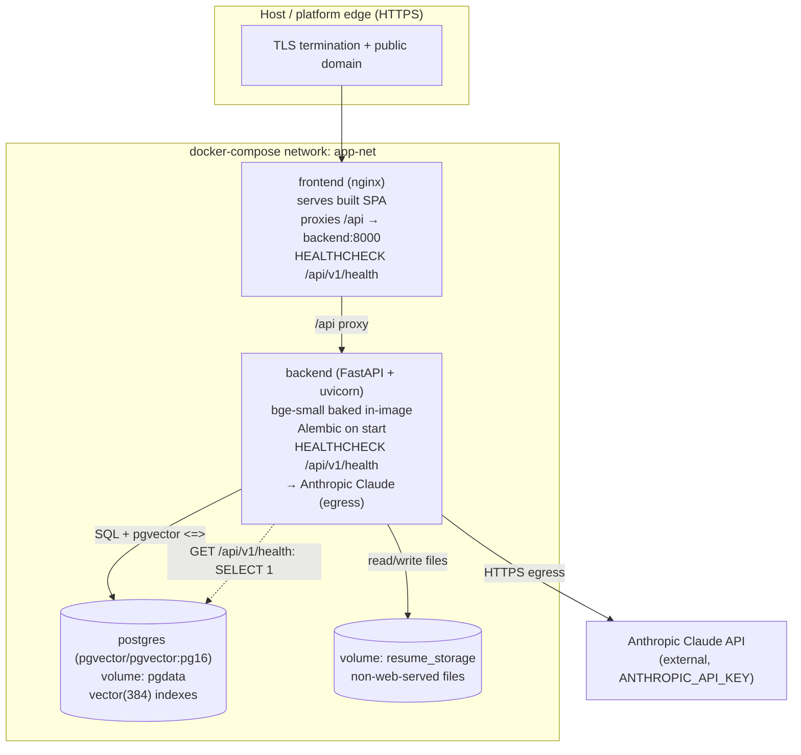
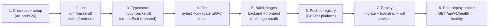

# Deployment Architecture — AI Professional Network (MVP)

**Project:** ai-professional-network
**Version:** 1.0 (MVP)
**Status:** Canonical-consistent with `project-manifest.json` (verification mode = local dev
servers; deployment method = docker-compose; services backend/frontend/postgres), `init.sh`,
and the layered `folder-structure.md`.

This document covers two paths:

1. **Local dev (primary verification mode)** — `uvicorn` + Vite dev servers, exactly as
   `init.sh` and `project-manifest.json.verification.local` describe.
2. **Containerized production** — Docker Compose (`backend`, `frontend`, `postgres`+pgvector),
   driven by a GitHub Actions CI/CD pipeline.

---

## 1. Environments

| Concern | Local dev (verification) | Production (containerized) |
|---------|--------------------------|----------------------------|
| Orchestration | `init.sh` (two background processes) | `docker-compose.yml` (3 services) |
| Backend | `uv run uvicorn src.main:app --host 0.0.0.0 --port 8000` | Gunicorn/uvicorn workers in `backend` image, behind frontend reverse proxy |
| Frontend | `npm run dev -- --port 3000` (Vite dev server, HMR) | Vite `build` → static assets served by nginx in `frontend` image |
| Database | local PostgreSQL+pgvector (container or local install) | `postgres` service (`pgvector/pgvector:pg16`) with named volume |
| Backend URL | `http://localhost:8000` | internal `http://backend:8000`, public via reverse proxy |
| Frontend URL | `http://localhost:3000` | public origin (HTTPS) |
| Health check | `GET http://localhost:8000/health` (+ frontend `:3000/health`) | `GET /api/v1/health` via reverse proxy + container healthchecks |
| Embedding model | downloaded to local HF cache on first run | **baked into the `backend` image** (no cold network pull at boot) |
| Secrets | `.env` copied from `.env.example` | platform secret store / injected env vars |
| TLS | none (localhost) | HTTPS terminated at the host platform's edge |

> The health endpoint is canonical: `GET /api/v1/health` returns
> `{ "status": "healthy", "database": "up", "version": "1.0.0", "time": "..." }` (200) or the
> `unhealthy`/`database:"down"` body with **503** when the `SELECT 1` check fails
> (`db/health.py`). The manifest's `http://localhost:8000/health` and `:3000/health` probes
> resolve through this (the frontend dev server exposes a trivial `/health` for the bootstrap
> script; in prod the reverse proxy forwards `/api/v1/health`).

### Local dev startup (mirrors `init.sh`)

```
backend:  cd backend && uv sync && uv run uvicorn src.main:app --host 0.0.0.0 --port 8000
frontend: cd frontend && npm ci && npm run dev -- --port 3000
env:      cp .env.example .env   # then add ANTHROPIC_API_KEY
```
First backend boot also runs migrations + (optionally) the seed/ingest bootstrap (§5).

---

## 2. Dockerfile strategy per service

### 2.1 Backend image (`backend/Dockerfile`) — Python 3.12 + uv, multi-stage

- **Stage `builder`:** `python:3.12-slim`, install `uv`, copy `pyproject.toml`/`uv.lock`,
  `uv sync --frozen --no-dev` into a venv. Reproducible, lockfile-pinned.
- **Model-bake step:** download `BAAI/bge-small-en-v1.5` into the image's Hugging Face cache
  during build so the container starts with **no external embedding fetch** (the model is
  loaded by `services/ai/embedding_provider.py` as an in-process singleton — open question #2
  resolved in favour of in-process for the MVP). Embeddings are entirely local; only Claude is
  an external call.
- **Stage `runtime`:** `python:3.12-slim`, copy the venv + baked model cache + `src/`,
  `migrations/`, `seeds/`, `kb/`, `scripts/`. Run as a non-root user. Entrypoint runs Alembic
  migrations then launches uvicorn workers. Container `HEALTHCHECK` curls
  `http://localhost:8000/api/v1/health`.
- Resume files persist to a mounted volume via `storage/local_storage.py` (non-web-served;
  open question #1 resolved in favour of local volume for the MVP, abstracted behind the
  storage interface for a later S3 swap).

### 2.2 Frontend image (`frontend/Dockerfile`) — build + static serve, multi-stage

- **Stage `build`:** `node:20-alpine`, `npm ci`, `npm run build` → static bundle in `dist/`.
  Vite build-time env (`VITE_API_BASE_URL`) points at the public API origin.
- **Stage `serve`:** `nginx:alpine` serving `dist/`. nginx config: SPA history fallback to
  `index.html`, gzip/brotli for assets, and a **reverse-proxy `location /api/`** forwarding to
  `http://backend:8000` (single public origin, keeps JWT same-origin, no CORS in prod).
- Container `HEALTHCHECK` curls the proxied `/api/v1/health`.

### 2.3 Postgres + pgvector

- Image `pgvector/pgvector:pg16` (extension preinstalled). Named volume for durable data.
  `CREATE EXTENSION IF NOT EXISTS vector;` is owned by the **first Alembic migration**, not the
  image, so the schema is reproducible and version-controlled (§5).

### 2.4 docker-compose topology



- **Service order / dependencies:** `postgres` (healthy) → `backend` (`depends_on: condition:
  service_healthy`, runs migrations + optional bootstrap) → `frontend`.
- **Networks:** single internal `app-net`; only `frontend` is published to the edge. `backend`
  and `postgres` are not directly exposed publicly.
- **Volumes:** `pgdata` (database), `resume_storage` (uploaded files).

---

## 3. CI/CD pipeline (GitHub Actions, `.github/workflows/`)

Assumed GitHub Actions. Stages run in order; a failure short-circuits the rest. The
coverage gate (≥80%) and typecheck are hard gates (Success Metric #4, manifest
`coverage_threshold: 80`).



Stage detail:

1. **Checkout + setup** — `actions/checkout`, install `uv` and Node 20; restore caches
   (uv venv, npm, HF model cache).
2. **Lint** — `ruff check backend`, `eslint` over `frontend/src`.
3. **Typecheck** — `mypy backend/src`, `tsc --noEmit` in `frontend`.
4. **Test** — `uv run pytest --cov=src/app --cov-fail-under=80` (job runs against a
   `pgvector/pgvector:pg16` service container); `npm run test` (vitest). Coverage below 80%
   fails the build.
5. **Build images** — build `backend` (incl. baked bge-small) and `frontend` images; tag with
   commit SHA. Runs only on the default branch / release.
6. **Push** — push tagged images to the registry (GHCR or the host platform's registry).
7. **Deploy** — trigger the host platform deploy; the backend release command runs Alembic
   migrations and, on first deploy, the seed + KB-ingestion bootstrap (§5), then rolls services.
8. **Post-deploy smoke** — poll `GET /api/v1/health` until `status:"healthy"` /
   `database:"up"`; fail (and trigger rollback, §8) otherwise.

PRs run stages 1–4 only (no build/deploy). Push to default branch / tagged release runs the
full pipeline.

---

## 4. Config & secrets management

**Principle (BRD §11):** all config externalized via env vars; **secrets never committed**.
`backend/.env.example` documents every variable with safe placeholders; the real `.env` is
git-ignored. `init.sh` copies `.env.example` → `.env` on first run and prompts to add keys.

| Variable | Purpose | Local dev | Production |
|----------|---------|-----------|------------|
| `DATABASE_URL` | Postgres + pgvector DSN | local DSN in `.env` | injected; points at `postgres` service |
| `ANTHROPIC_API_KEY` | Claude access (only external secret) | developer's key in `.env` | platform secret store; injected at runtime, never in image/logs |
| `JWT_SECRET` | Access-token signing | dev value in `.env` | strong random secret in secret store |
| `ACCESS_TOKEN_TTL_SECONDS` | 900 (15 min) | `.env` | env |
| `REFRESH_TOKEN_TTL_DAYS` | refresh lifetime | `.env` | env |
| `AI_RATE_LIMIT_PER_HOUR` | 10/hr/user AI limit | `.env` | env |
| `CLAUDE_MODEL_REVIEW` / `CLAUDE_MODEL_DEFAULT` | model ids (e.g. `claude-opus-4-8`, `claude-sonnet-4-6`) | `.env` | env |
| `AI_REQUEST_TIMEOUT_SECONDS` | 60 | `.env` | env |
| `EMBEDDING_MODEL` | `BAAI/bge-small-en-v1.5` (dim 384) | `.env` | env (model baked into image) |
| `RESUME_STORAGE_DIR` | local storage volume path | `.env` | mounted volume path |
| `CORS_ALLOW_ORIGINS` | dev: `http://localhost:3000` | `.env` | empty/same-origin (proxy) |
| `VITE_API_BASE_URL` | SPA → API base | `http://localhost:8000` | public origin / `/api` (proxied) |

Notes:
- `config/settings.py` (`pydantic-settings`) validates required vars at startup and **fails
  fast** with a clear message if a secret/key is missing (BRD: misconfiguration is a named
  failure mode). `config/llm_config.py` centralizes model ids, max tokens, timeout, and the AI
  rate limit for future token-budget/provider switching.
- `ANTHROPIC_API_KEY` is the only outbound secret; it is never logged (`ai_request_logs` is
  metadata-only) and never embedded in an image layer.
- CI secrets (registry creds, deploy token, a test `ANTHROPIC_API_KEY` if integration tests
  exercise Claude — otherwise Claude is mocked in tests) live in GitHub Actions encrypted
  secrets.

---

## 5. Database migrations, pgvector provisioning, and bootstrap

**Migrations on deploy.** Alembic (`backend/alembic.ini`, `migrations/env.py`) runs as the
backend release/entrypoint step before serving traffic, in both local first-boot and prod
deploy. `migrations/env.py` loads `Settings` so the DSN is environment-driven.

**pgvector provisioning.** The first migration runs `CREATE EXTENSION IF NOT EXISTS vector;`
then creates tables and the HNSW vector indexes on the three embedding columns
(`resumes.embedding`, `jobs.embedding`, `knowledge_chunks.embedding`), all `vector(384)` to
match `bge-small` — any other dimension is a defect (`data-models.md` §0).

**Seed + KB-ingestion bootstrap (idempotent).** After migrations, a one-time bootstrap runs:
- `scripts/seed_jobs.py` — loads `seeds/jobs/jobs_seed.json` (~500–1000 postings) via the
  `JobLoader`, embeds each description with the local provider, and indexes into `jobs`.
- `scripts/ingest_kb.py` — chunks `kb/*.md`, embeds, and indexes into `knowledge_chunks`.

Both are **idempotent**: jobs key on `external_ref`, KB chunks key on `content_hash`
(`UNIQUE`), so re-running on every deploy is safe and only ingests new/changed content.
Bootstrap order: migrate → ingest KB → seed jobs → start serving.

---

## 6. Health checks, readiness/liveness, observability

- **Combined health (MVP):** `GET /api/v1/health` is both liveness and readiness
  (`api-contracts.md` §1; `db/health.py`). It returns 200 `healthy`/`database:"up"` or 503
  `unhealthy`/`database:"down"` based on a `SELECT 1`. Container `HEALTHCHECK` directives and
  the post-deploy smoke step both target it.
- **Compose:** `postgres` uses `pg_isready`; `backend`/`frontend` use the curl-based
  `/api/v1/health` check; `backend depends_on postgres: service_healthy`.
- **Readiness gate at boot:** backend serves traffic only after migrations + bootstrap succeed,
  so a passing `/api/v1/health` implies a migrated, seeded, embedding-ready service.
- **Observability/logging:** structured JSON logs with the AI `request_id` correlation id.
  `ai_request_logs` records per-call metadata only — `feature`, `model_id`, `outcome`
  (`success`/`retry_success`/`failed`/`timeout`/`invalid_schema`/`rate_limited`), `latency_ms`,
  `input_tokens`, `output_tokens`, `retry_count` — and **never PII, prompt content, or resume
  text** (BRD §11, `data-models.md` §4). Request logs likewise never emit PII columns
  (`users.email`, `profiles.full_name`, `resumes.original_filename`, `structured_content`).
  Rate-limit responses expose `X-RateLimit-*` and `Retry-After` headers.

---

## 7. Public host — options and recommended default

Open question #3 (BRD §13) leaves the public host open across Render / Railway / Fly.io / VPS.
All four can run the docker-compose topology; trade-offs:

| Option | Fit | Trade-offs |
|--------|-----|-----------|
| **Render** *(recommended default)* | Native managed PostgreSQL **with pgvector**, Docker + Blueprint (`render.yaml`) mapping cleanly to the 3 services, free TLS + domain, GitHub-triggered deploys + one-click rollback, release command for migrations | Cold starts / limited resources on free tier (acceptable for a portfolio MVP) |
| Railway | Simple Docker deploys, managed Postgres, good DX | pgvector availability varies; less explicit release-command story |
| Fly.io | Global edge, Docker-native, volumes for resume storage; can run the baked bge-small image close to users | More manual networking/volume config; Postgres+pgvector is self-managed |
| VPS (Docker Compose) | Full control, runs `docker-compose.yml` as-is | You own TLS, backups, patching, monitoring — most ops overhead |

**Recommendation: Render.** It maps 1:1 to the manifest's docker-compose topology, offers
managed Postgres with pgvector (no self-managed DB ops), free HTTPS + custom domain, native
GitHub Actions integration, a release/pre-deploy command slot for Alembic migrations + the
bootstrap step, and built-in deploy history with one-click rollback — the lowest-friction path
to satisfying Success Metric #3 (public deployment with CI/CD). The `frontend` (nginx, proxies
`/api`), `backend`, and managed `postgres` map directly to Render services; secrets
(`ANTHROPIC_API_KEY`, `JWT_SECRET`) go in Render's encrypted env groups.

---

## 8. Rollback procedure

Deploys are immutable and image-tagged (commit SHA), so rollback is redeploying the previous
known-good tag.

1. **Detect** — post-deploy smoke (`GET /api/v1/health` ≠ `healthy`) or error-rate spike
   triggers rollback (automatic on smoke failure; manual otherwise).
2. **Revert app** — redeploy the previous image tag (Render/Railway deploy history "rollback",
   Fly.io `fly releases`/`fly deploy --image <prev>`, or `docker compose up -d` with the prior
   tag on a VPS). The frontend and backend roll back together.
3. **Database safety** — migrations are **forward-only and backward-compatible** within a
   release (additive columns/indexes; no destructive drops in the same deploy as code that
   still needs them). Because bootstrap is idempotent, no data rollback is needed. If a
   migration is genuinely incompatible, ship the schema change one release ahead of the code
   that depends on it (expand → migrate → contract), so an app rollback never requires a DB
   downgrade.
4. **Verify** — re-run the smoke check on the restored version; confirm `/api/v1/health`
   `healthy` and a sample authenticated flow.
5. **Postmortem** — correlate via `ai_request_logs.request_id` / structured logs (metadata
   only); no PII is exposed during investigation.
