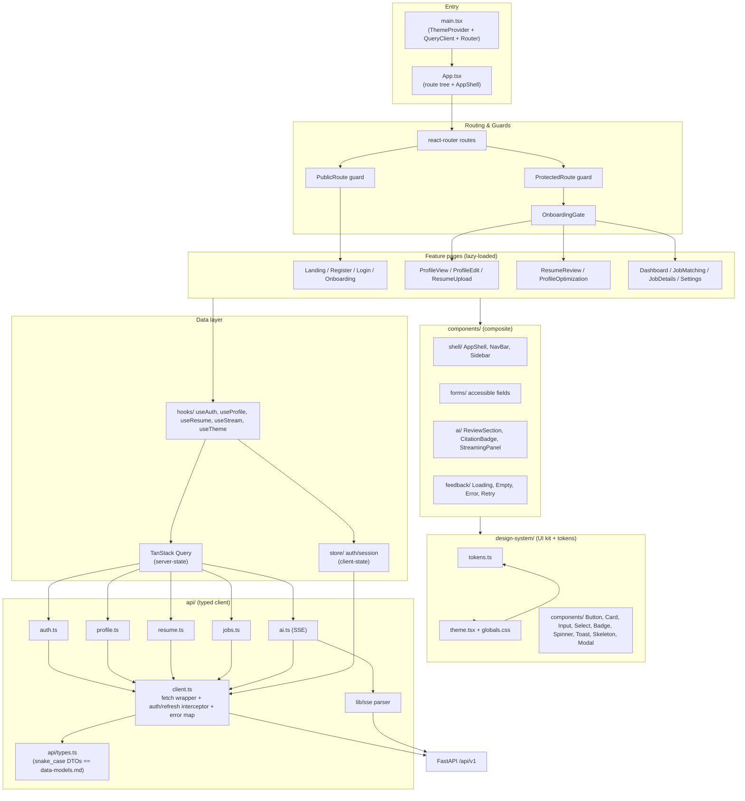
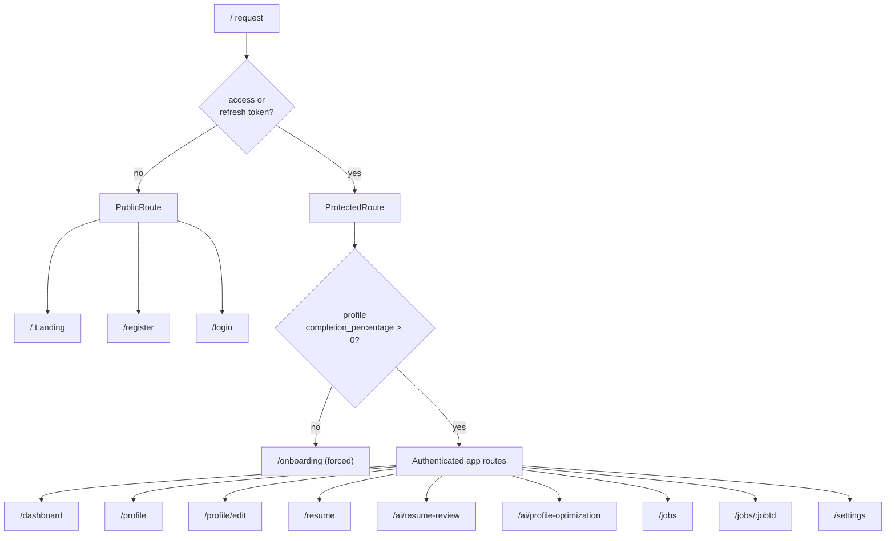
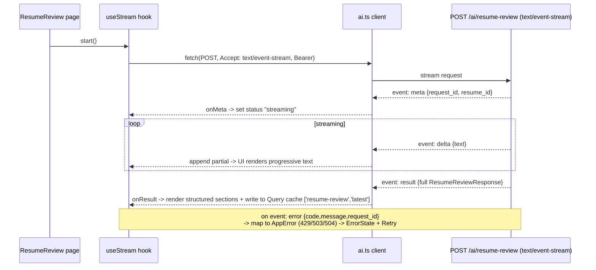
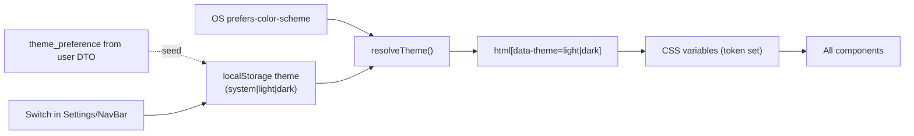

# Frontend Architecture — AI Professional Network (MVP)

**Project:** ai-professional-network
**Version:** 1.0 (MVP)
**Stack:** React 18 + TypeScript (strict) + Vite + npm
**Status:** Canonical for the frontend. Derives all data shapes from `data-models.md`
and all endpoints from `api-contracts.md` (snake_case on the wire). Directory paths
match `folder-structure.md`. Covers epic **E8** (E8-S1 … E8-S5).

> Scope note: this is a **design document**. No implementation code is produced here —
> only architecture, contracts mapping, and conventions for the generator/ui-designer
> agents to execute against.

---

## 0. Goals & non-negotiables

| Requirement | How this architecture satisfies it |
|---|---|
| AI-first SaaS brand (NOT a LinkedIn clone) | Token-driven design system with gradient/AI accents, spacious card layouts, strong hierarchy (§5). |
| 13 screens, desktop-primary, responsive | Route-per-screen with code-splitting (§1, §2, §8); responsive shell + layout primitives (§7). |
| WCAG 2.1 AA | Accessibility plan baked into the design system and every primitive (§6). |
| Light + dark mode, OS default + manual toggle | First-class CSS-variable token layer; theme resolved before paint (§5.4). |
| Sync API calls with loading states; SSE for resume review | TanStack Query for server-state; dedicated SSE client for streaming review (§3, §4.5). |
| JWT access + opaque refresh flow | Typed API client with attach/refresh interceptor + route guards (§2.2, §4.2). |
| snake_case wire contract | DTO types mirror `data-models.md` verbatim; **no camelCase mapping layer** (§4.1). |

---

## 1. App structure & module decomposition

The frontend keeps the same one-way dependency discipline as the backend:
**design-system → components → (api + hooks + store) → pages → app shell/router**.
Lower layers never import upward.



**Module responsibilities**

| Module (path) | Responsibility | May import |
|---|---|---|
| `src/design-system/` | Tokens, theming engine, accessible UI primitives. No business logic, no API. | nothing app-level |
| `src/components/` | Composite, reusable building blocks (shell, forms, AI display, feedback states). | design-system |
| `src/api/` | Typed HTTP client, per-resource call modules, DTO types (snake_case). | lib, store (token read only) |
| `src/lib/` | Pure helpers: formatters, validators (Zod), SSE parser. | none |
| `src/store/` | Client-state only: auth/session + theme persistence. | api/client (for refresh) |
| `src/hooks/` | Query/mutation hooks binding pages to server-state + SSE. | api, store, lib |
| `src/pages/` | Screen composition; one file per screen (route-level code-split). | components, hooks, design-system |
| `src/App.tsx` / `main.tsx` | Providers (Theme, QueryClient), route tree, guards, shell. | everything below |

---

## 2. Routing strategy

`react-router` (data router). Three route classes: **public**, **protected**, and
**protected + onboarding-gated**. Each page is a `React.lazy` chunk (§8).



### 2.1 Route table

| Path | Screen | Class | Guard behaviour |
|---|---|---|---|
| `/` | Landing | public | If authenticated, redirect to `/dashboard`. |
| `/register` | Register | public | If authenticated, redirect to `/dashboard`. |
| `/login` | Login | public | If authenticated, redirect to `/dashboard`. |
| `/onboarding` | Onboarding | protected, gate-exempt | Reachable only when authenticated; forced target when profile is empty. |
| `/dashboard` | Dashboard | protected + gated | — |
| `/profile` | Profile View | protected + gated | — |
| `/profile/edit` | Profile Edit | protected + gated | — |
| `/resume` | Resume Upload | protected + gated | — |
| `/ai/resume-review` | AI Resume Review | protected + gated | — |
| `/ai/profile-optimization` | AI Profile Optimization | protected + gated | — |
| `/jobs` | Job Matching | protected + gated | — |
| `/jobs/:jobId` | Job Details | protected + gated | — |
| `/settings` | Settings | protected + gated | — |
| `*` | NotFound | passthrough | 404 inside the shell when authenticated, else minimal page. |

### 2.2 Route guards & the JWT/refresh flow (E8-S2)

- **Session source of truth:** the in-memory `authStore` holds the current `access_token`
  and the decoded user (`id`, `email`, `theme_preference`). The refresh token is **never held
  by the SPA** — it lives only in an HttpOnly cookie the browser manages (see §4.2). Because
  the access token is in memory, a hard reload always rehydrates the session by calling
  `POST /api/v1/auth/refresh`, which succeeds silently if the refresh cookie is still valid.
- **`ProtectedRoute`:** if there is no valid in-memory access token, it triggers a one-shot
  `POST /api/v1/auth/refresh` (with credentials, via the client interceptor) and shows a
  full-page skeleton until it resolves. If the refresh cookie is missing/expired the call
  returns `401` → redirect to `/login` preserving `?next=`.
- **`PublicRoute`:** authenticated users are bounced to `/dashboard` (no flashing the
  marketing page to logged-in users).
- **`OnboardingGate`:** wraps all gated routes. It reads the cached `GET /api/v1/profile`
  result. **Onboarding completion = `completion_percentage > 0`** (the BRD onboarding flow
  persists initial fields via `PUT /profile`, lifting completion off zero). If `0`, any gated
  route redirects to `/onboarding`; conversely `/onboarding` redirects to `/dashboard` once
  completion is non-zero, preventing re-entry.

> Rationale for using `completion_percentage` as the gate signal: the contract already
> computes it deterministically server-side (`data-models.md` §2.3) and returns it on every
> `GET /profile`. No extra "onboarded" flag is needed, avoiding a schema addition.

---

## 3. State management

**Decision: TanStack Query (React Query) for all server-state + a tiny client-state
store (React Context / Zustand-style) for session and theme.** No Redux.

### 3.1 Why this split

| Concern | Tool | Justification |
|---|---|---|
| Server-state (profile, resume, reviews, jobs, matches) | **TanStack Query** | These are remote, cacheable, refetchable resources with loading/error/stale semantics. Query gives caching, dedup, retries, `isLoading/isError/isSuccess` states, and invalidation out of the box — directly satisfying the "synchronous calls with loading states" + empty/error UI requirements. Avoids hand-rolled reducers per endpoint. |
| Session/auth (access token, current user) | **Light client store** | Access token is sensitive, in-memory, and not a cacheable "resource"; it gates the whole router. A small store keeps it out of the query cache and lets the API interceptor read/refresh it. |
| Theme preference | **Light client store + localStorage** | UI-only client state; must apply before first paint (§5.4). |
| Streaming review | **Local component state fed by SSE** | A stream is an event sequence, not a cache entry; the final `result` event is then written into the Query cache (`ai/resume-review/latest`) so other screens (Dashboard) see it. |
| Ephemeral UI (modals, toasts, form state) | **Local component state / React Hook Form** | No global store needed. |

### 3.2 Query key / mutation map (binds directly to the contract)

| Query key | Endpoint | Notes |
|---|---|---|
| `['profile']` | `GET /api/v1/profile` | Source for OnboardingGate + Dashboard completion. |
| `['resume']` | `GET /api/v1/resume` | 404 → treated as "no resume" empty state, not error. |
| `['resume-review','latest']` | `GET /api/v1/ai/resume-review/latest` | Hydrated by the streaming `result` event. |
| `['profile-optimization','latest']` | `GET /api/v1/ai/profile-optimization/latest` | |
| `['jobs', {limit,offset,q}]` | `GET /api/v1/jobs` | Paginated list. |
| `['job', jobId]` | `GET /api/v1/jobs/{job_id}` | |
| `['job-match','latest']` | derived from `POST /api/v1/jobs/match` result | Last run cached for Dashboard "matched jobs". |

| Mutation | Endpoint | On success |
|---|---|---|
| `register` | `POST /auth/register` | store tokens → set `['profile']` (empty) → route `/onboarding`. |
| `login` | `POST /auth/login` | store tokens → prefetch `['profile']` → route `/dashboard` or `?next`. |
| `logout` | `POST /auth/logout` | clear store + `queryClient.clear()` → `/login`. |
| `updateProfile` | `PUT /profile` | optimistic update of `['profile']` (§8.2). |
| `uploadResume` | `POST /resume` (multipart) | set `['resume']`; invalidate review/match. |
| `deleteResume` | `DELETE /resume/{id}` | invalidate `['resume']`, `['resume-review','latest']`, `['job-match','latest']`. |
| `runProfileOptimization` | `POST /ai/profile-optimization` | set `['profile-optimization','latest']`. |
| `runJobMatch` | `POST /jobs/match` | set `['job-match','latest']`. |

**Query client defaults:** `staleTime` 30 s for read resources; **`retry: false` for all
`/ai/*` and `/jobs/match` mutations** (the backend already does single-retry guardrails and
these are rate-limited — client retries would burn the 10/hr budget); `retry: 1` for idempotent
GETs. Mutations never auto-retry.

---

## 4. API client layer

### 4.1 Typed DTOs — mirror the canonical contracts exactly

`src/api/types.ts` holds hand-authored TypeScript interfaces that are a **1:1 mirror of the
snake_case shapes in `api-contracts.md` / `data-models.md`**. There is intentionally **no
camelCase transform layer** — the wire format is snake_case end-to-end (contract §0), so
field names match the JSON verbatim. This eliminates a class of frontend/backend disagreement.

Representative types (names/fields exactly as in the contracts):

```ts
// auth — refresh token is NOT in the body; it arrives as an HttpOnly cookie
interface AuthSessionResponse {
  user: { id: string; email: string; theme_preference: 'system'|'light'|'dark'; created_at: string };
  access_token: string; token_type: 'bearer'; expires_in: number;
}
interface TokenRefreshResponse {
  access_token: string; token_type: 'bearer'; expires_in: number;
}

// profile (matches ProfileResponse)
interface ProfileResponse {
  id: string; user_id: string;
  full_name: string | null; headline: string | null; summary: string | null;
  skills: string[];
  education: EducationItem[]; experience: ExperienceItem[];
  certifications: CertificationItem[]; projects: ProjectItem[];
  completion_percentage: number; incomplete_sections: string[]; updated_at: string;
}

// resume
interface ResumeResponse {
  id: string; user_id: string; original_filename: string; mime_type: string;
  size_bytes: number; file_hash: string;
  parse_status: 'pending'|'parsed'|'failed';
  structured_content: StructuredResume | null;
  parse_error: string | null; disclosure: string; created_at: string;
}

// AI review (matches ResumeReviewResponse / ResumeReviewContent + Citation)
interface ReviewItem { text: string; source_id: string | null }
interface Citation { source_id: string; source_file: string; snippet: string | null }
interface ResumeReviewResponse {
  id: string; resume_id: string; status: 'pending'|'completed'|'failed';
  content: { overall_summary: string; strengths: ReviewItem[]; weaknesses: ReviewItem[];
             ats_issues: ReviewItem[]; suggestions: ReviewItem[] };
  sources: Citation[]; cached: boolean; model_id: string; request_id: string; created_at: string;
}

// jobs (JobSummary embedded in matches; JobDetailResponse for detail)
interface JobSummary {
  id: string; title: string; company: string; location: string;
  employment_type: string | null; seniority: string | null; skills: string[];
}
interface JobMatchItem { rank: number; fit_score: number; fit_explanation: string; gaps: string[]; job: JobSummary }
interface JobMatchResponse { run_id: string; resume_id: string; model_id: string; request_id: string; matches: JobMatchItem[]; created_at: string }

// standard error envelope
interface ApiError { error: { code: string; message: string; request_id?: string } }
```

`EducationItem`, `ExperienceItem`, `CertificationItem`, `ProjectItem`, `StructuredResume`,
`ContactInfo`, `ProfileOptimizationContent` mirror `data-models.md` §3 field-for-field.

> Generation option: these types MAY be generated from `api-contracts.schema.json` via
> `openapi-typescript` in CI to guarantee drift-free sync. The hand-authored file above is
> the fallback and the source of truth for review; if generation is wired up, the generated
> file replaces `types.ts` and the build fails on drift.

### 4.2 Auth attach / refresh interceptor (`api/client.ts`)

A single `request<T>()` wrapper:

1. **Credentials:** every auth-endpoint request (`/auth/login`, `/auth/register`,
   `/auth/refresh`, `/auth/logout`) is sent with `credentials: 'include'` so the browser
   sets/sends the HttpOnly refresh cookie. (Requires credentialed CORS on the backend.)
2. **Attach:** reads `access_token` from `authStore`; sets `Authorization: Bearer <token>`
   (skipped for `/auth/register`, `/auth/login`, `/auth/refresh`, `/health`).
3. **Refresh-on-401:** on a `401`, the client calls `POST /auth/refresh` **once** (no body,
   `credentials: 'include'`), using a shared in-flight promise so concurrent 401s coalesce
   into a single refresh (no thundering herd). The server reads the refresh cookie, rotates
   it (a new cookie is set via `Set-Cookie`), and returns a fresh `access_token`; the client
   stores **only the new access token in memory** and replays the original request. On refresh
   failure it clears the session and rejects with an `unauthorized` error that the router turns
   into a `/login` redirect.
4. **No refresh loop:** a 401 from `/auth/refresh` itself never re-refreshes.

**Token storage (security posture):** the access token lives **in memory only**; the refresh
token is **never accessible to JavaScript** — it is an `HttpOnly; Secure; SameSite=Strict`
cookie scoped to `Path=/api/v1/auth`, set and rotated by the server (see
`security-architecture.md` and contract §0). This is the deliberate hardening over a
localStorage approach: HttpOnly removes the XSS token-theft vector, and `SameSite=Strict` +
the scoped path mitigate CSRF for the MVP. The SPA never reads, stores, or attaches the
refresh token; the browser carries it automatically only to `/auth/refresh` and
`/auth/logout`.

### 4.3 Error handling & normalization

The client maps every non-2xx into a typed `AppError`:

| HTTP | Normalized kind | Default UI treatment |
|---|---|---|
| `401` (after refresh fails) | `unauthorized` | Redirect to `/login`. |
| `403` | `forbidden` | Inline "you don't have access" state. |
| `404` | `not_found` | Resource-specific empty state (e.g. no resume yet). |
| `409` | `conflict` | Inline actionable message (`email_already_registered`, `profile_insufficient`, `resume_not_parsed`). |
| `415` / `422 file_*` | `invalid_file` | Upload error toast + inline field message. |
| `422` (Pydantic) | `validation` | Map `detail[].loc` → form field errors. |
| `429` | `rate_limited` | Surface `Retry-After`; show countdown + retry-disabled state. |
| `503` / `504` | `ai_unavailable` | Actionable "AI is busy/unavailable, try again" + retry. |
| network/abort | `network` | Generic retryable error state. |

The `request_id` from AI error envelopes is shown discreetly (small monospace text) so users
can quote it in support — satisfying the correlation requirement without leaking internals.

### 4.4 Loading / empty / error UI states

Every server-bound view renders one of four states via the `feedback/` components, driven by
TanStack Query flags:

- **Loading** → route/section **Skeleton** (never a bare spinner for primary content).
- **Empty** → `EmptyState` with a primary CTA (e.g. "Upload a resume to get a review").
- **Error** → `ErrorState` with the normalized message + `RetryButton` (calls `refetch`/
  re-mutate).
- **Success** → content.

These four states are mandatory for: Dashboard, Profile View, Resume Upload, Resume Review,
Profile Optimization, Job Matching, Job Details.

### 4.5 SSE streaming consumption for resume review (E8-S4 AC1)

The resume-review endpoint supports streaming when called with `Accept: text/event-stream`
(contract §5). Because `EventSource` cannot set headers or use POST, the client uses
**`fetch` + `ReadableStream` + a hand-rolled SSE parser** in `src/lib/sse.ts`, surfaced
through the `useStream` hook.



Behavioural rules:
- The parser splits on `\n\n`, reads `event:` and `data:` lines, and `JSON.parse`es `data`.
- `meta` → enter streaming state (show a streaming panel + animated AI accent).
- `delta` → append to an in-memory buffer rendered progressively (the "blob-as-it-streams"
  view), with `aria-live="polite"` so screen readers get periodic updates without spamming.
- `result` → swap the progressive buffer for the **structured** render (strengths /
  weaknesses / ATS issues / suggestions with `CitationBadge`), and seed the Query cache so a
  revisit reads from `GET /ai/resume-review/latest` without re-streaming.
- `error` → abort, normalize, show retry. An `AbortController` cancels the stream on unmount.
- **Fallback:** if streaming fails to start (proxy strips SSE), the hook retries once in
  plain JSON mode (no `Accept` header) and renders the structured result directly.

---

## 5. Design system

A **token-first** system. Tokens are authored once in `design-system/tokens.ts` and projected
into **CSS custom properties** in `globals.css`. Dark mode is a parallel token set selected by
a `data-theme` attribute — not an override sprinkled across components.

> Styling mechanism: CSS variables are the canonical theming layer. If Tailwind is used, its
> `theme` config consumes the same token variables (`colors: { bg: 'var(--color-bg)' }`) so
> there is one source of truth; if plain CSS Modules are used, they read the same variables.
> Either way, components reference **semantic tokens**, never raw hex.

### 5.1 Color tokens (semantic, dual-palette)

Two layers: a **primitive palette** (raw scales) and **semantic tokens** that map to
primitives per theme. Components only use semantic tokens.

| Semantic token | Light | Dark | Role |
|---|---|---|---|
| `--color-bg` | near-white `#FBFBFD` | deep slate `#0B0E14` | App background |
| `--color-surface` | `#FFFFFF` | `#141925` | Card / panel surface |
| `--color-surface-raised` | `#FFFFFF` + shadow | `#1B2230` | Elevated card |
| `--color-text` | `#0F172A` | `#E6EAF2` | Primary text |
| `--color-text-muted` | `#475569` | `#9AA6B8` | Secondary text (AA on surface) |
| `--color-border` | `#E5E8EF` | `#27303F` | Hairlines |
| `--color-primary` | `#5B5BD6` (indigo) | `#8B8BF0` | Brand / primary action |
| `--color-primary-contrast` | `#FFFFFF` | `#0B0E14` | Text on primary |
| `--color-accent` | `#22B8CF` (cyan) | `#3DD6E6` | AI accent (gradients) |
| `--color-success / warning / danger` | AA pairs | AA pairs | Status |
| `--gradient-ai` | `linear-gradient(135deg,#5B5BD6,#22B8CF)` | brighter variant | AI feature headers, hero |

All foreground/background pairings are chosen to meet **WCAG AA (≥4.5:1 body, ≥3:1 large/UI)**
in both themes; contrast is a token-design constraint, not a post-hoc fix (§6).

### 5.2 Typography, spacing, radius, shadow, motion

- **Type scale** (modular ~1.25): `--font-size-xs 12 / sm 14 / base 16 / lg 18 / xl 22 /
  2xl 28 / 3xl 36 / display 48`. Sans UI font (e.g. Inter); generous line-height (1.5 body).
  Weights 400/500/600/700.
- **Spacing scale** (4px base): `--space-1 4 … 2 8, 3 12, 4 16, 6 24, 8 32, 12 48, 16 64`.
  Spacious layouts use the larger steps.
- **Radius:** `--radius-sm 8`, `--radius-md 12`, `--radius-lg 16`, `--radius-xl 24`,
  `--radius-pill 999` — soft, rounded, brand-consistent.
- **Shadow:** `--shadow-sm/md/lg` (softer + lower-opacity in dark mode to avoid muddy edges).
- **Motion:** `--motion-fast 120ms`, `--motion-base 200ms`, `--motion-slow 320ms`, standard
  easing `cubic-bezier(.2,.8,.2,1)`. All transitions are **disabled under
  `prefers-reduced-motion`** (§6).

### 5.3 Component library inventory

| Group | Components |
|---|---|
| **Primitives** (`design-system/components/`) | Button (primary/secondary/ghost/danger, loading state), IconButton, Input, Textarea, Select, Checkbox, Radio, Switch (theme toggle), Badge, Chip/Tag (skills), Card, Spinner, **Skeleton**, Toast/Toaster, Modal/Dialog, Tooltip, Progress (completion ring/bar), Tabs, Avatar. |
| **Composite** (`components/`) | `shell/` AppShell + NavBar + Sidebar; `forms/` FormField (label+error+hint), ValidatedInput; `ai/` ReviewSection, CitationBadge, StreamingPanel, ScoreMeter (fit score), GapList; `feedback/` LoadingState, EmptyState, ErrorState, RetryButton, ConfirmDialog. |

Every primitive ships with: focus-visible ring, AA contrast, keyboard support, and a
`data-theme`-aware appearance — so screens compose accessibility for free.

### 5.4 Theming mechanism (dark mode as a first-class layer)



- **Pre-paint application:** a tiny inline script in `index.html` resolves theme from
  `localStorage` (falling back to `prefers-color-scheme`) and sets `html[data-theme]` **before
  React mounts**, eliminating flash-of-wrong-theme.
- **Three modes:** `system` (default, follows OS via a `matchMedia` listener), `light`,
  `dark`. The `ThemeProvider` exposes `{ mode, resolved, setMode }`; the Settings/NavBar
  `Switch` cycles/sets the mode and persists it (E8-S1 AC2, E8-S5 AC4).
- **Server alignment:** the user's `theme_preference` from `AuthSessionResponse` seeds the
  client preference on login; the manual toggle is local-first (no profile write required for
  MVP, since there is no theme-update endpoint in the contract).

---

## 6. Accessibility plan (WCAG 2.1 AA)

Targets E8-S1 AC4, E8-S2 AC3, E8-S4 AC4, E8-S5 AC5.

| Area | Rule |
|---|---|
| **Semantic HTML** | Landmarks: `header`/`nav`/`main`/`footer`; headings in order (one `h1` per screen); lists for skill chips and review items; `button` for actions, `a` for navigation. |
| **Keyboard nav** | All interactive elements reachable and operable by keyboard; logical tab order; visible `:focus-visible` ring (token `--color-primary`); Esc closes modals; arrow-key support in Tabs/Select. |
| **Focus management** | On route change, move focus to the screen `h1` (or `main`) and announce via `aria-live`. Modals trap focus and restore it to the trigger on close. |
| **ARIA usage** | Used only to fill gaps: `aria-live="polite"` for streaming review + toasts; `aria-invalid` + `aria-describedby` linking inputs to error text; `aria-busy` during loading; `aria-current="page"` in nav. No ARIA where native semantics suffice. |
| **Color contrast** | Token pairs meet ≥4.5:1 (text) / ≥3:1 (UI + large text) in both themes; never color-only signalling (icons/text accompany status colors). |
| **Forms** | Every field has a programmatic `<label>`; inline validation messages are associated and screen-reader-announced; error summary on submit; the login error is generic (`invalid_credentials`) per contract — never reveals whether the email exists (E8-S2 AC2). |
| **Reduced motion** | `@media (prefers-reduced-motion: reduce)` disables non-essential transitions/animations (including the AI streaming shimmer). |
| **Targets & zoom** | ≥44px touch targets on mobile; layouts reflow without loss up to 200% zoom. |
| **Verification** | `eslint-plugin-jsx-a11y` in CI (E8-S1 AC5) + axe checks in vitest component tests. |

---

## 7. Responsive strategy

Desktop-primary, graceful down to mobile browsers (E8-S1 AC3, all-screen AC5s).

| Breakpoint token | Min width | Layout intent |
|---|---|---|
| `--bp-sm` | 0–639px | Mobile: single column; sidebar collapses to a bottom/hamburger nav; cards full-width. |
| `--bp-md` | 640–1023px | Tablet: two-column where it helps; condensed sidebar; comfortable touch targets. |
| `--bp-lg` | 1024–1439px | Desktop (primary): persistent sidebar + content; multi-column dashboard grid. |
| `--bp-xl` | ≥1440px | Wide desktop: max content width clamp (~1200–1320px), more whitespace. |

**Layout primitives** (in shell/design-system): `Container` (max-width clamp + responsive
gutters), `Stack` (vertical rhythm), `Cluster`/`Inline` (wrapping rows), `Grid`
(auto-fit `minmax` for card grids). Pages compose these rather than writing bespoke media
queries. The `AppShell` switches between persistent sidebar (≥lg) and collapsible nav (<lg).

---

## 8. Performance & UX

### 8.1 Code-splitting & loading

- **Route-level `React.lazy` + `Suspense`** per page → each screen is its own chunk; the
  marketing Landing and the heavy authenticated app load independently.
- **Suspense fallbacks are skeletons** matching each screen's layout, not spinners.
- Vendor split (router, query, design-system) via Vite `manualChunks`. Prefetch the likely
  next route (e.g. prefetch Dashboard chunk while on Login).

### 8.2 Optimistic vs pessimistic updates

| Action | Strategy | Why |
|---|---|---|
| `PUT /profile` (edit) | **Optimistic** | Fast, low-risk, reversible; on error roll back the `['profile']` cache and toast. Recompute display completion from server response on settle. |
| Theme toggle | **Optimistic** | Pure client state. |
| `POST /resume` upload | **Pessimistic** | Server parses + structures; show parsing loading state, then render returned `structured_content` (E8-S3 AC5). No optimistic guess. |
| `DELETE /resume/{id}` | **Pessimistic + confirm** | Destructive (cascades reviews/matches); `ConfirmDialog` then invalidate (E8-S5 AC4). |
| `POST /ai/*`, `POST /jobs/match` | **Pessimistic** | LLM results can't be predicted; rate-limited; show loading/streaming then render. |

### 8.3 Error boundaries & resilience

- A top-level **ErrorBoundary** inside the shell catches render-time crashes and shows an
  accessible recovery screen (never a white screen / stack trace — E8-S4 AC4).
- Per-route ErrorBoundaries isolate a screen crash from the shell/nav.
- Query/SSE errors are data-state errors (handled in §4.3–4.5), distinct from boundary
  crashes.

---

## 9. Screen → route → API mapping (all 13 screens)

Endpoints reference `api-contracts.md` exactly (base path `/api/v1`).

| # | Screen | Route | Primary endpoint(s) | Story |
|---|---|---|---|---|
| 1 | Landing | `/` | none (marketing) | E8-S2 |
| 2 | Register | `/register` | `POST /api/v1/auth/register` | E8-S2 |
| 3 | Login | `/login` | `POST /api/v1/auth/login` (+ interceptor `POST /auth/refresh`) | E8-S2 |
| 4 | Onboarding | `/onboarding` | `PUT /api/v1/profile` (seed initial fields) → `GET /api/v1/profile` | E8-S2 |
| 5 | Dashboard | `/dashboard` | `GET /api/v1/profile`, `GET /api/v1/ai/resume-review/latest`, `GET /api/v1/ai/profile-optimization/latest`, `GET /api/v1/resume`, last `POST /api/v1/jobs/match` (cached) | E8-S5 |
| 6 | Profile View | `/profile` | `GET /api/v1/profile` | E8-S3 |
| 7 | Profile Edit | `/profile/edit` | `GET /api/v1/profile`, `PUT /api/v1/profile` | E8-S3 |
| 8 | Resume Upload | `/resume` | `POST /api/v1/resume` (multipart), `GET /api/v1/resume`, `DELETE /api/v1/resume/{resume_id}` | E8-S3 |
| 9 | AI Resume Review | `/ai/resume-review` | `POST /api/v1/ai/resume-review` (**SSE**), `GET /api/v1/ai/resume-review/latest` | E8-S4 |
| 10 | AI Profile Optimization | `/ai/profile-optimization` | `POST /api/v1/ai/profile-optimization`, `GET /api/v1/ai/profile-optimization/latest` | E8-S4 |
| 11 | Job Matching | `/jobs` | `POST /api/v1/jobs/match`, `GET /api/v1/jobs` (browse) | E8-S5 |
| 12 | Job Details | `/jobs/:jobId` | `GET /api/v1/jobs/{job_id}` | E8-S5 |
| 13 | Settings | `/settings` | `DELETE /api/v1/resume/{resume_id}`, `POST /api/v1/auth/logout`, theme toggle (client) | E8-S5 |

### 9.1 Dashboard composition note (E8-S5 AC1)

The Dashboard is a hub that fans out into parallel cached queries, each rendering its own
loading/empty/error state independently (no single blocking spinner):

| Card | Source | Links to |
|---|---|---|
| **Profile completion** | `GET /profile` → `completion_percentage` + `incomplete_sections` (ring + checklist) | `/profile/edit` |
| **Recent AI analyses** | `GET /ai/resume-review/latest` + `GET /ai/profile-optimization/latest` (summary, `cached` badge, timestamps) | `/ai/resume-review`, `/ai/profile-optimization` |
| **Matched jobs** | latest `['job-match','latest']` run (top 3 by `fit_score`) or empty-state CTA if none | `/jobs`, `/jobs/:jobId` |
| **Recommended next actions** | derived from `incomplete_sections`, missing resume (`GET /resume` 404), and absent analyses (e.g. "Upload a resume", "Run a resume review", "Optimize your profile") | the relevant screen |

Each next-action is computed client-side from already-cached data — no new endpoint — and
every card deep-links to its screen, satisfying AC1.

---

## 10. Quality gates (frontend)

- `tsc --noEmit` and `eslint` (incl. `jsx-a11y`) pass with zero errors (E8-S1 AC5).
- Every screen renders in light + dark and at sm/md/lg/xl without layout breakage.
- Every endpoint in §9 maps to a typed call in `src/api/*` whose DTO matches `api-contracts.md`
  (snake_case, no camelCase on the wire).
- Resume Review consumes SSE with progressive rendering and a structured final view (E8-S4).
- All AI screens render accessible, retryable error states for 429/503/504 (E8-S4 AC4).
- No screen can be reached while unauthenticated; gated screens redirect to onboarding until
  `completion_percentage > 0`.
