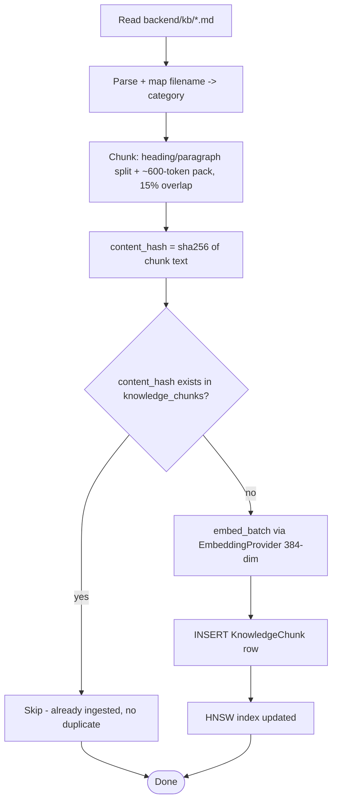
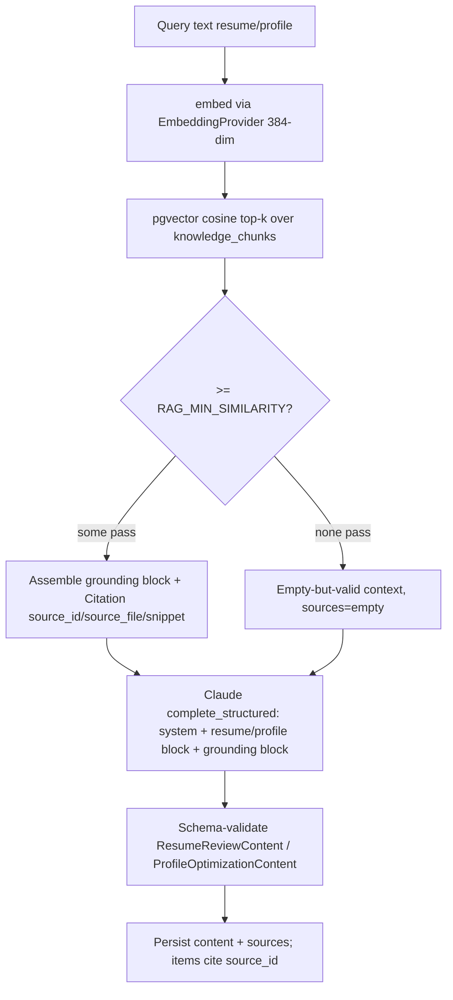
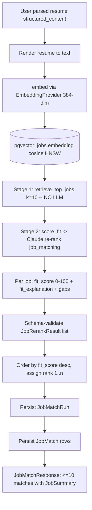

# RAG Pipeline — AI Professional Network (MVP)

**Project:** ai-professional-network
**Version:** 1.0 (MVP)
**Status:** Canonical design. Derives from `data-models.md` and `api-contracts.md`; do not contradict them.
**Date:** 2026-06-30
**Companion:** `ai-service-architecture.md` (Claude client, prompt/injection, service catalog).

This document specifies the **retrieval-augmented generation pipeline** end to end: the curated
knowledge corpus and its ingestion job, chunking + embedding + pgvector indexing, the
`EmbeddingProvider` abstraction, retrieve-then-generate with citation tracking, and the
**two-stage job matching** pipeline (vector top-10 → LLM re-rank). It implements BRD §8 (RAG
pipeline + job matching) and stories **E5-S1/S2/S3** and **E7-S1/S2**.

Embedding model is the local **`BAAI/bge-small-en-v1.5`**, output dimension **384** — the
canonical `vector(384)` of `data-models.md` §0. Any other dimension is a defect.

---

## 0. Module map (consistent with `component-map.md`)

| Concern | Module | Story |
|---------|--------|-------|
| Embedding provider (interface + local impl) | `app/services/ai/embedding_provider.py` | E5-S1 |
| KB ingestion + chunking | `app/services/ai/kb_ingestion.py`, `backend/scripts/ingest_kb.py` | E5-S2 |
| KnowledgeChunk repository (pgvector) | `app/repositories/knowledge_repository.py` | E5-S2 |
| RAG retrieval service | `app/services/ai/rag_retrieval.py` | E5-S3 |
| Job repository + seed + vector index | `app/repositories/job_repository.py`, `backend/seeds/loaders/job_loader.py`, `backend/scripts/seed_jobs.py` | E7-S1 |
| Job matching (two-stage) | `app/services/job_matching_service.py`, `app/repositories/job_match_repository.py` | E7-S2 |
| KB source markdown | `backend/kb/*.md` | E5-S2 |

---

## 1. Knowledge corpus

A curated, version-controlled markdown knowledge base — the grounding for explainable AI
outputs (BRD §5, §8). It lives in the repo at `backend/kb/` so it is reviewable, diffable, and
ingested deterministically.

| File | `category` (enum) | Content |
|------|-------------------|---------|
| `ats_best_practices.md` | `ats` | ATS parsing rules: plain text, no tables/graphics, standard headings, keyword alignment, file formats. |
| `resume_writing.md` | `resume` | Strong action verbs, measurable outcomes, bullet structure, length, tailoring. |
| `profile_optimization.md` | `profile` | Headline formulas, summary structure, skills selection, completeness. |
| `interview_prep.md` | `interview` | Behavioral/STAR, common questions, prep checklist (grounding for future features). |
| `career_guidance.md` | `career` | Early-career role selection, skill gaps, growth paths. |

`category` is constrained to `ats | resume | profile | interview | career` (`data-models.md` §0,
§2.10). MVP RAG features draw primarily from `ats`, `resume`, and `profile`; `interview`/`career`
are seeded for forward compatibility.

---

## 2. KnowledgeChunk schema (canonical — `data-models.md` §2.10)

| Field | Type | Notes |
|-------|------|-------|
| `id` | UUID | PK |
| `source_file` | TEXT | e.g. `ats_best_practices.md` (for citation) |
| `category` | TEXT | enum above |
| `chunk_index` | INTEGER | order within source file; part of stable `source_id` |
| `content` | TEXT | chunk text, ≤ ~1000 tokens |
| `content_hash` | TEXT | SHA-256 of content; **UNIQUE** → idempotent ingestion |
| `embedding` | `vector(384)` | **[VEC384]** bge-small embedding of `content` |
| `created_at` | TIMESTAMPTZ | |

**Citation contract (`data-models.md` §2.10):** retrieval emits `{source_id, source_file,
snippet}` where `source_id = "{category}-{chunk_index}"` (e.g. `ats-1`). This is the stable
handle that AI feature outputs attach to each `ReviewItem` (`data-models.md` §3.8).

**Indexes:** `UNIQUE (content_hash)`; `INDEX (source_file, chunk_index)`; HNSW vector index:
```sql
CREATE INDEX knowledge_chunks_embedding_hnsw
  ON knowledge_chunks USING hnsw (embedding vector_cosine_ops);
```

---

## 3. Chunking, embedding, and indexing

### 3.1 Chunking strategy (E5-S2 AC1)

- **Unit:** split each markdown file on heading/paragraph boundaries first, then pack into
  chunks of **~500–800 tokens** with **~80–120 token (≈15%) overlap**. Hard ceiling ≤ ~1000
  tokens (`data-models.md` §2.10) to bound prompt size and embedding quality.
- **Boundary awareness:** never split mid-sentence; prefer to break at headings/blank lines so a
  chunk is a coherent, citable idea.
- **Metadata per chunk:** `source_file`, `category` (derived from a front-matter tag or a
  filename→category map), `chunk_index` (0-based order within the file).
- **`content_hash`:** SHA-256 of the normalized chunk text — the idempotency key.

bge-small was trained with a 512-token window; chunks at ~500–800 tokens with overlap balance
recall against truncation. (If a chunk exceeds the model window the provider truncates; chunker
targets stay under it for the bulk of content.)

### 3.2 Embedding (E5-S2 AC2)

Each chunk's `content` is embedded by the `EmbeddingProvider` (§4) into a 384-dim float vector
and stored in `embedding`. Ingestion uses `embed_batch` for throughput.

### 3.3 pgvector indexing

- **Distance:** **cosine** (`vector_cosine_ops`) for all three vector tables
  (`knowledge_chunks`, `resumes`, `jobs`) — consistent so resume/job/KB vectors are comparable.
- **Index type:** **HNSW** (low write volume, fast recall — `data-models.md` §2.4, §2.7, §2.10).
  `ivfflat WITH (lists≈100)` after `ANALYZE` is the documented fallback.
- Vectors are normalized by the model output; cosine similarity = `1 - cosine_distance`.

### 3.4 Ingestion job (idempotent — E5-S2 AC4)

Run via `backend/scripts/ingest_kb.py` (CLI / one-shot container task; no background queue in
MVP per BRD §8):



Idempotency: `UNIQUE (content_hash)` + pre-check means re-running on unchanged files inserts
nothing; an edited chunk changes its hash → new row (the operator may prune obsolete chunks for a
re-authored file by `source_file`). This satisfies E5-S2 AC4.

---

## 4. EmbeddingProvider abstraction (E5-S1)

### 4.1 Interface (E5-S1 AC1)

```text
class EmbeddingProvider(Protocol):
    dimension: int                                  # MUST be 384 for MVP
    def embed_text(self, text: str) -> Vector384
    def embed_batch(self, texts: list[str]) -> list[Vector384]
```

### 4.2 Local implementation (E5-S1 AC2–4)

`LocalBgeEmbeddingProvider`:
- Loads `BAAI/bge-small-en-v1.5` via sentence-transformers, **bundled in-container** (no external
  embeddings API in v1 — BRD §10).
- Produces **384-dim** float vectors; deterministic (same text → identical vector — E5-S1 AC3).
- **Lazy singleton:** the model is loaded once on first use and reused for the process lifetime,
  so cold-start cost is paid at most once per process (E5-S1 AC4; see §6).
- Deterministic settings: eval mode, no dropout, fixed normalization.

### 4.3 Swapping providers later (E5-S1 AC5)

Callers (`rag_retrieval`, `kb_ingestion`, `job_repository`, `job_matching_service`,
`resume_review_service`) import **only** the `EmbeddingProvider` interface; the concrete class is
wired from config. A hosted provider (e.g. a managed embeddings API) is a new implementation +
config change, **no caller edits**.

**Dimension consideration:** the DB columns are `vector(384)`. A provider with a different output
dimension requires a migration (column re-type) **and** a full re-embed/re-index of all three
vector tables. The provider exposes `dimension`; a startup assertion fails fast if it disagrees
with the configured/DB dimension, preventing silent corruption (`data-models.md` §0: "any
mismatch is a defect").

---

## 5. Retrieve-then-generate (E5-S3)

Clean separation: **retrieval contains no LLM call** (E5-S3 AC5). Generation (the Claude call) is
owned by the AI feature services and the centralized client (`ai-service-architecture.md` §4–5).

### 5.1 Query construction

| Feature | Query text built from |
|---------|-----------------------|
| Resume review (E6-S2) | the structured resume rendered to text (skills + experience + summary), emphasizing ATS/formatting concerns |
| Profile optimization (E6-S3) | profile headline + summary + skills + section state |

The query is embedded with the **same** `EmbeddingProvider` so it shares the KB's vector space.

### 5.2 Top-k retrieval + relevance (E5-S3 AC1, AC4)

```text
retrieve(query_text, k=RAG_TOP_K (default 5)):
    qv = embed(query_text)
    rows = knowledge_repo.search(qv, k)   # ORDER BY embedding <=> qv (cosine) LIMIT k
    return assemble(rows)
```

`k` is configurable (`RAG_TOP_K`) and bounded by default to control prompt size (E5-S3 AC4).
A minimum-similarity floor (`RAG_MIN_SIMILARITY`) filters near-irrelevant chunks.

### 5.3 Grounding assembly + citation tracking (E5-S3 AC2, AC5)

Each retrieved row becomes a `Citation` (`data-models.md` §3.9) and a labeled grounding line:

```text
[ats-1] (ats_best_practices.md) "Avoid tables and multi-column layouts; ATS parsers..."
[resume-3] (resume_writing.md) "Start bullets with strong action verbs and quantify impact..."
```

The service returns `RetrievedContext{ block: str, sources: list[Citation] }`. The block is
injected as the `<grounding>` data block (`ai-service-architecture.md` §2.3); Claude attaches the
matching `source_id` to each generated `ReviewItem` (`data-models.md` §3.8). The service persists
`sources[]` onto `resume_reviews.sources` / `profile_optimizations.sources` and drops any
`source_id` the model invents that is not in `sources` before persistence
(`api-contracts.md` §5 note: every item `source_id` must exist in `sources`).

### 5.4 Empty / weak result handling (E5-S3 AC3)

If no chunk clears `RAG_MIN_SIMILARITY`, `retrieve` returns an **empty-but-valid**
`RetrievedContext{block: "", sources: []}` — **not** an error. Generation proceeds with an
explicit "no grounding available; rely on general best practice and do not fabricate citations"
instruction, so items carry `source_id: null`. This is graceful degradation, not a failure (see
§7).

### 5.5 Retrieve-then-generate flow



---

## 6. Cold-start latency mitigation (local model)

The bge-small model and its weights must load into the FastAPI process before the first
embedding. Mitigations:

- **Eager warm-up on startup:** a FastAPI lifespan hook triggers one throwaway `embed_text("warmup")`
  so the singleton (§4.2) loads weights during boot, not on the first user request.
- **Lazy singleton fallback:** if warm-up is skipped (e.g. tests), the model still loads at most
  once per process (E5-S1 AC4).
- **In-process, bundled weights:** no network fetch at request time (BRD §10); weights are baked
  into the container image.
- **Health gating:** readiness can include "embedding model loaded" so traffic is routed only
  after warm-up, keeping non-AI p95 < 300 ms (BRD §4) unaffected by model load.

---

## 7. Failure modes & graceful degradation

| Failure mode (BRD §11) | Where | Graceful behavior |
|------------------------|-------|-------------------|
| Weak matches on small corpus | retrieval / matching | Return honest low scores / empty-but-valid grounding; never error (E5-S3 AC3, E7-S2 AC4). |
| Model cold-start latency | embedding | Warm-up on boot + readiness gating (§6). |
| KB empty / not yet ingested | retrieval | Empty-but-valid context; generation proceeds sans citations (§5.4). |
| Embedding dimension mismatch | startup | Fail fast via `dimension` assertion (§4.3). |
| pgvector index missing | retrieval | Sequential cosine scan still correct (just slower); index is an optimization. |
| LLM invalid JSON / transient / timeout | generation | Single retry then safe error; no partial persist (`ai-service-architecture.md` §1.5–1.7). |
| Prompt injection in resume/job text | generation | Delimited untrusted blocks + system precedence + schema validation (`ai-service-architecture.md` §2.2). |
| Resume not parsed | matching | `409 resume_not_parsed`, actionable message (E7-S2 AC6; `api-contracts.md` §6). |

---

## 8. Two-stage job matching (E7-S1, E7-S2)

The BRD §8 matching pipeline: **embed resume → pgvector top-10 candidate retrieval → LLM re-rank
with fit/gap explanation.** Stage 1 is cheap vector recall (no LLM); stage 2 is a single Claude
re-rank over only 10 candidates (cost-bounded).

### 8.1 Stage 1 — candidate retrieval (E7-S1 AC2–3)

- Seed corpus: ~500–1000 realistic jobs (E7-S1 AC1) loaded behind a **loader interface**
  (`job_loader.py`) so a real jobs API can replace the seed without touching retrieval (E7-S1
  AC5; BRD §10). Each `jobs.description` is embedded to `vector(384)` (E7-S1 AC2).
- `retrieve_top_jobs(query_embedding, k=10)` runs a pgvector cosine query over `jobs.embedding`
  (HNSW index) returning the 10 nearest jobs ordered by similarity (E7-S1 AC3). **No LLM.**

### 8.2 Stage 2 — LLM re-rank (E7-S2 AC2–3)

`score_fit(structured_resume, candidate_jobs[10])` calls Claude via
`complete_structured(feature=job_matching, ...)`. Per candidate the model returns
`{job_id, fit_score 0–100, fit_explanation, gaps[]}`, schema-validated. Results are ordered by
**descending `fit_score`** and `rank` (1-based) assigned. Weak candidates get honest low scores;
the service never fails on a weak set (E7-S2 AC4).

### 8.3 Persistence mapping (→ `data-models.md` §2.8–2.9)

| Re-rank output | Persisted column |
|----------------|------------------|
| (the run) | `job_match_runs` row: `user_id`, `resume_id`, `status='completed'`, `model_id` (§2.8) |
| `job_id` | `job_matches.job_id` (§2.9) |
| `fit_score` | `job_matches.fit_score` (SMALLINT 0–100, CHECK) |
| `fit_explanation` | `job_matches.fit_explanation` (TEXT) |
| `gaps[]` | `job_matches.gaps` (JSONB `list[str]`) |
| derived order | `job_matches.rank` (INTEGER, 1-based desc by fit_score) |

`UNIQUE (run_id, job_id)` and `INDEX (run_id, rank)` (§2.9) keep a run's set atomic and ordered.
The API response (`api-contracts.md` §6 `JobMatchResponse`) embeds a `JobSummary` per match
(no `description`/`embedding`). An LLM failure after the single retry → safe error, **no partial
match set persisted** (E7-S2 AC5).

### 8.4 Two-stage matching pipeline (Mermaid)



---

## 9. Consistency checklist

- Embedding dimension fixed at **384** (bge-small) across `knowledge_chunks`, `resumes`, `jobs`
  (`data-models.md` §0).
- `KnowledgeChunk` fields/indexes/citation contract match `data-models.md` §2.10.
- Citations use `{source_id, source_file, snippet}` with `source_id = "{category}-{chunk_index}"`
  (`data-models.md` §2.10, §3.9) and feed `ReviewItem.source_id` (§3.8).
- Two-stage matching maps onto `job_match_runs` (§2.8) + `job_matches` (§2.9); top-k = 10;
  vector-first, LLM-second (BRD §8; `api-contracts.md` §6).
- Cosine distance + HNSW indexes match `data-models.md` §2.4/2.7/2.10.
- `EmbeddingProvider` interface + lazy singleton + provider-swap match E5-S1.
- Retrieval is LLM-free and returns empty-but-valid on weak KB (E5-S3 AC3, AC5).
- Module paths match `component-map.md`.
