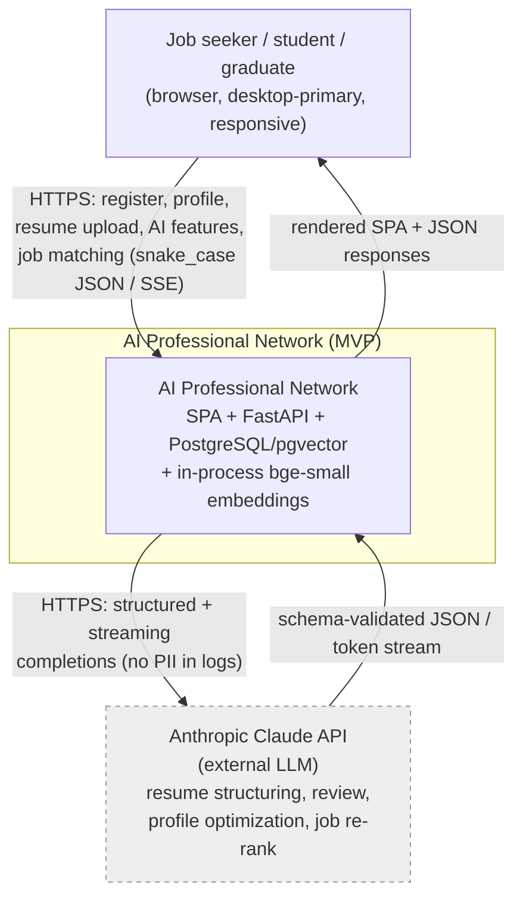
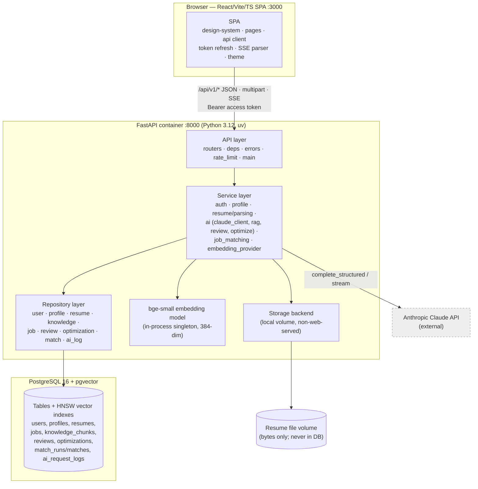
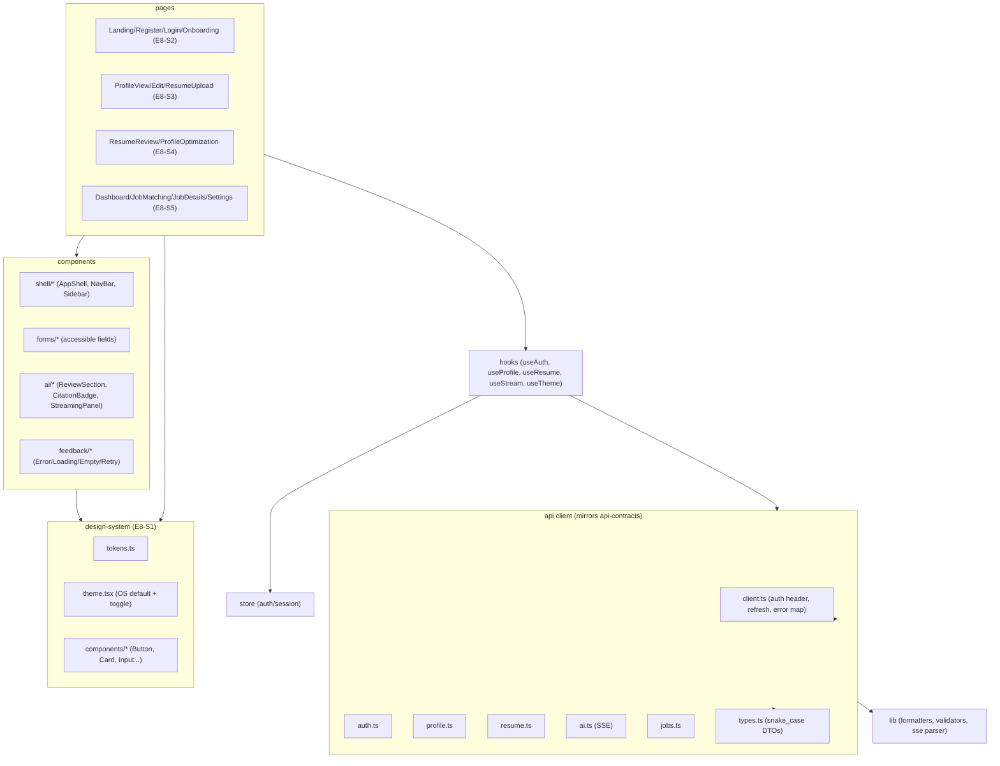
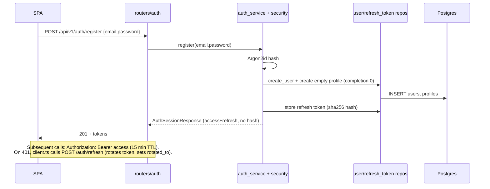
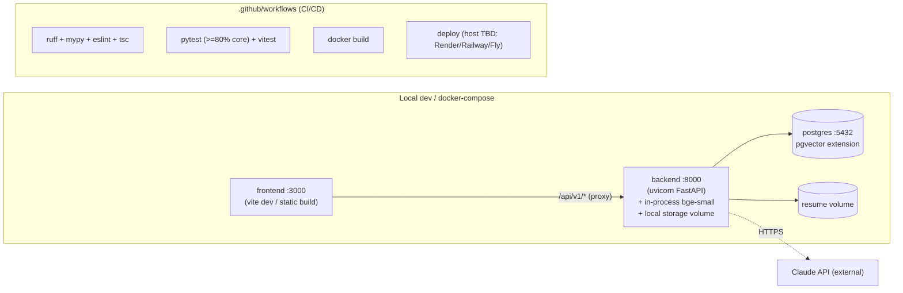

# System Design — AI Professional Network (MVP)

**Project:** ai-professional-network
**Version:** 1.0 (MVP)
**Status:** Design documentation. Consistent with the canonical contracts:
`data-models.md`, `api-contracts.md`, `folder-structure.md`, `component-map.md`.
**Date:** 2026-06-30

This document describes the high-level system architecture: context, containers, component
decomposition, request/data flow, infrastructure topology, cross-cutting concerns, the
scalability path, and explicit extensibility for future LangGraph-based agentic workflows.
It introduces **no new entities, fields, or endpoints** beyond the canonical contracts.

---

## 1. Architectural principles

| # | Principle | Where it shows up |
|---|-----------|-------------------|
| 1 | **Strict layered architecture, one-way dependencies** — Types → Config → Repository → Service → API → UI. A layer may import only from layers below it. | `folder-structure.md` package layout; enforced by import-linter in CI (§7). |
| 2 | **LLM/RAG logic lives in the service layer only.** Repositories do data access; the API does HTTP. | `services/ai/*`, `services/parsing/*`, `services/job_matching_service.py`. |
| 3 | **Typed boundaries.** Every cross-layer call passes Pydantic DTOs/domain types (`app/types/*`); no dicts leak across layers. | `types/domain.py`, `types/dto.py`, `types/structured.py`, `types/ai.py`. |
| 4 | **snake_case on the wire.** Request and response JSON match DB column names; no camelCase translation layer. | `api-contracts.md` §0; frontend `api/types.ts`. |
| 5 | **Services have no HTTP coupling.** Each endpoint maps 1:1 to a service function taking typed inputs and returning typed DTOs — the seam a future agent calls as tools (§9). | `api-contracts.md` §8. |
| 6 | **Provider abstractions for swappable externals.** `EmbeddingProvider`, `StorageBackend`, `JobLoader`, centralized `claude_client` + `llm_config`. | §6, §8, §9. |
| 7 | **RAG-grounded, schema-validated AI (Option B).** Retrieve-then-generate; every AI output is Pydantic-validated; one retry on invalid output. | `services/ai/*`; `design-rationale.md` D1. |
| 8 | **Privacy by construction.** PII and embeddings never logged; `AIRequestLog` is metadata-only. | `data-models.md` §4; §7 below. |

---

## 2. System context (C4 Level 1)



**Boundary notes**
- The **only external runtime dependency is the Claude API.** No external jobs API, no OAuth
  provider, no hosted embeddings in v1 (`brd.md` §10).
- The embedding model (`BAAI/bge-small-en-v1.5`, 384-dim) runs **in-process** inside the
  FastAPI container — no network hop, no embeddings vendor.
- Resume content is processed by Claude; this is **disclosed to users** in the resume-upload
  response (`api-contracts.md` §4) and UI (`ResumeUpload.tsx`).

---

## 3. Container view (C4 Level 2)



**Containers**

| Container | Tech | Responsibility |
|-----------|------|----------------|
| **SPA** | React 18, TypeScript 5, Vite | All UI/UX; typed API client mirroring `api-contracts.md`; token refresh; SSE streaming display; light/dark theming; WCAG 2.1 AA. |
| **FastAPI app** | Python 3.12, FastAPI, uv | Layered backend; hosts the in-process embedding model and storage backend; sole caller of Claude. |
| **PostgreSQL + pgvector** | Postgres 16, pgvector | Relational data + `vector(384)` columns with HNSW indexes for resumes, jobs, knowledge chunks. |
| **Resume file volume** | Local volume (MVP) behind `StorageBackend` | Holds uploaded bytes at opaque `storage_key`; never web-served; never in DB. |
| **Claude API** | Anthropic (external) | Structuring, review, optimization, job re-rank. |

---

## 4. Component decomposition (C4 Level 3)

### 4.1 Backend modules by layer

```mermaid
flowchart TB
    subgraph L1["Layer 1 — Types (app/types)"]
        t_domain["domain.py"]
        t_dto["dto.py"]
        t_struct["structured.py"]
        t_ai["ai.py"]
        t_enum["enums.py"]
    end

    subgraph L2["Layer 2 — Config (app/config)"]
        c_set["settings.py"]
        c_llm["llm_config.py"]
    end

    subgraph L3["Layer 3 — Persistence (app/db, app/repositories, app/storage)"]
        d_sess["db/session.py · base.py · models.py · health.py"]
        r_user["user_repository"]
        r_token["refresh_token_repository"]
        r_prof["profile_repository"]
        r_res["resume_repository"]
        r_kn["knowledge_repository"]
        r_job["job_repository"]
        r_rev["resume_review_repository"]
        r_opt["profile_optimization_repository"]
        r_match["job_match_repository"]
        r_log["ai_log_repository"]
        st_base["storage/base.py (StorageBackend)"]
        st_local["storage/local_storage.py"]
    end

    subgraph L4["Layer 4 — Services (app/services)"]
        s_auth["auth_service + security"]
        s_prof["profile_service"]
        s_res["resume_service"]
        s_extr["parsing/extractor"]
        s_struc["parsing/structurer"]
        s_claude["ai/claude_client"]
        s_emb["ai/embedding_provider"]
        s_rag["ai/rag_retrieval"]
        s_kb["ai/kb_ingestion"]
        s_rev["ai/resume_review_service"]
        s_optsvc["ai/profile_optimization_service"]
        s_jm["job_matching_service"]
    end

    subgraph L5["Layer 5 — API (app/api)"]
        a_main["main.py · deps.py · errors.py · rate_limit.py"]
        a_health["routers/health"]
        a_auth["routers/auth"]
        a_profile["routers/profile"]
        a_resume["routers/resume"]
        a_ai["routers/ai"]
        a_jobs["routers/jobs"]
    end

    L2 --> L1
    L3 --> L1
    L3 --> L2
    L4 --> L1
    L4 --> L2
    L4 --> L3
    L5 --> L4
    L5 --> L1
```



Key composition edges within the service layer (consistent with the dependency graph):
- `resume_service` → `parsing/extractor` (local text), `parsing/structurer` → `claude_client`, `embedding_provider`, `resume_repository`, `storage`.
- `resume_review_service` → `rag_retrieval`, `claude_client`, `embedding_provider`, `resume_review_repository` (hash cache).
- `profile_optimization_service` → `profile_service`, `rag_retrieval`, `claude_client`, `profile_optimization_repository`.
- `job_matching_service` → `embedding_provider`, `job_repository.retrieve_top_jobs(k=10)`, `claude_client` (re-rank), `job_match_repository`.
- `claude_client` → `ai_log_repository` (metadata-only) + `llm_config`.

### 4.2 Frontend modules



The frontend api modules are a 1:1 mirror of `api-contracts.md`: `auth.ts` → `/auth/*`,
`profile.ts` → `/profile`, `resume.ts` → `/resume`, `ai.ts` → `/ai/*` (SSE on resume-review),
`jobs.ts` → `/jobs/*`. `client.ts` owns Bearer injection, transparent refresh-token rotation,
and mapping of the standard error envelope.

---

## 5. Request / data-flow narrative (core vertical)

The MVP vertical is **sign up → profile → resume upload → AI resume review → AI profile
optimization → AI job matching.** Below are the load-bearing flows.

### 5.1 Authentication & session



### 5.2 Resume upload → hybrid parse (extract → LLM structure → embed)

```mermaid
sequenceDiagram
    participant U as SPA
    participant API as routers/resume
    participant RS as resume_service
    participant EX as parsing/extractor
    participant STc as parsing/structurer
    participant CL as claude_client
    participant EMB as embedding_provider
    participant ST as storage (local volume)
    participant RR as resume_repository
    participant DB as Postgres

    U->>API: POST /api/v1/resume (multipart file)
    API->>RS: parse_and_store(user, file)
    RS->>RS: validate MIME+ext, size <=5MB, compute sha256
    alt unsupported / too large / unreadable
        RS-->>API: domain error -> 415 / 422 (stores nothing)
    else valid
        RS->>ST: save bytes at opaque storage_key
        RS->>EX: extract text (pypdf / python-docx)
        EX-->>RS: raw text (treated as untrusted)
        RS->>STc: structure(text)  %% system instructions override injection
        STc->>CL: complete_structured(StructuredResume schema)
        CL-->>STc: validated StructuredResume (1 retry on invalid)
        RS->>EMB: embed(resume text) -> vector(384)
        RS->>RR: save metadata + structured_content + embedding, parse_status=parsed
        RR->>DB: INSERT/UPDATE resumes
        RS-->>API: ResumeResponse (+ disclosure; no storage_key/embedding)
        API-->>U: 201
    end
```

### 5.3 AI Resume Review (RAG-grounded, cached, streaming)

```mermaid
sequenceDiagram
    participant U as SPA
    participant RL as rate_limit (AI 10/hr)
    participant API as routers/ai
    participant RV as resume_review_service
    participant CACHE as resume_review_repository
    participant RAG as rag_retrieval
    participant KR as knowledge_repository
    participant CL as claude_client
    participant LOG as ai_log_repository

    U->>RL: POST /api/v1/ai/resume-review (Accept: text/event-stream?)
    RL->>RL: check per-user hourly budget
    alt over limit
        RL-->>U: 429 rate_limited (+Retry-After), LLM NOT invoked
    else allowed
        RL->>API: pass
        API->>RV: review_resume(user, resume_id?)
        RV->>CACHE: lookup by resume_file_hash (completed)
        alt cache hit
            CACHE-->>RV: prior review
            RV-->>U: ResumeReviewResponse cached=true (no LLM, no budget consumed)
        else cache miss
            RV->>RAG: retrieve(resume context, k)
            RAG->>KR: pgvector top-k over knowledge_chunks
            KR-->>RAG: chunks
            RAG-->>RV: context block + citations [{source_id,...}]
            RV->>CL: complete_structured / stream (ResumeReviewContent)
            CL->>LOG: write metadata only (feature, model, outcome, latency, tokens)
            CL-->>RV: validated content (1 retry; 503/504 on provider fail/timeout)
            RV->>CACHE: persist completed review + sources
            RV-->>U: JSON ResumeReviewResponse OR SSE meta/delta/result
        end
    end
```

Every `ReviewItem.source_id` references an entry in `sources` (explainability, E6-S2 AC2).
**Profile Optimization** follows the same RAG-grounded shape against the user's profile
(`profile_optimization_service` → `rag_retrieval` → `claude_client`), returning
`ProfileOptimizationContent`; result is persisted and re-fetchable via
`GET /ai/profile-optimization/latest` without a new LLM call. A too-sparse profile returns
`409 profile_insufficient`.

### 5.4 AI Job Matching (two-stage: vector top-10 → LLM re-rank)

```mermaid
sequenceDiagram
    participant U as SPA
    participant RL as rate_limit (AI 10/hr)
    participant API as routers/jobs
    participant JM as job_matching_service
    participant EMB as embedding_provider
    participant JR as job_repository
    participant CL as claude_client
    participant MR as job_match_repository

    U->>RL: POST /api/v1/jobs/match
    RL->>API: within budget
    API->>JM: match_jobs(user)
    alt no parsed resume
        JM-->>U: 409 resume_not_parsed (actionable, not 500)
    else
        JM->>EMB: reuse/compute resume embedding
        JM->>JR: retrieve_top_jobs(embedding, k=10)  %% pgvector cosine, no LLM
        JR-->>JM: top-10 candidate jobs
        JM->>CL: re-rank with fit_score 0-100 + fit_explanation + gaps
        CL-->>JM: validated, ranked matches (honest low scores allowed)
        JM->>MR: persist job_match_run + job_matches (rank by fit_score desc)
        JM-->>U: JobMatchResponse (matches with JobSummary; no description/embedding)
    end
```

---

## 6. Infrastructure topology

**Primary mode is local verification** (manifest `verification.mode = "local"`): backend on
`:8000`, frontend on `:3000`, Postgres local. **Docker Compose** provides a reproducible
identical stack (manifest `deployment.method = "docker-compose"`, services
`backend, frontend, postgres`).



**Bootstrap order (compose):** Postgres healthy (pgvector enabled via migration) → backend
runs Alembic migrations on startup, lazy-loads the embedding singleton → optional one-time
`scripts/ingest_kb.py` and `scripts/seed_jobs.py` (chunk/embed/index KB and ~500–1000 jobs) →
frontend served. Health gate: `GET /api/v1/health` returns `database: up` before traffic.

**Config & secrets:** all values via env vars (`backend/.env.example` documents them); secrets
never committed; HTTPS in deployment (`brd.md` §11). The deployment host is an open question
(`brd.md` §13.3) and does not affect this architecture.

---

## 7. Cross-cutting concerns

| Concern | Approach | Location |
|---------|----------|----------|
| **Configuration** | `pydantic-settings` `Settings` with fail-fast validation at startup (missing keys/env → refuse to boot). Centralized `llm_config` (model id, max tokens, 60 s timeout, `AI_RATE_LIMIT_PER_HOUR`) for future token budgets/provider switch. | `config/settings.py`, `config/llm_config.py` |
| **Logging** | Structured logs keyed by `request_id`. **Never** log PII (`users.email`, `profiles.full_name`, `resumes.original_filename`, `structured_content`/contact, raw bytes) or embeddings. AI calls recorded in `ai_request_logs` as **metadata only** (feature, model, outcome, latency, tokens, retry_count). | `claude_client`, `ai_log_repository`, `data-models.md` §4 |
| **Error handling** | Domain errors → standard error envelope `{error:{code,message,request_id?}}` via FastAPI exception handlers; `422` keeps the Pydantic field shape. Safe user-facing messages, no internal detail. AI errors map to `429 / 503 / 504` and always carry `request_id`. | `api/errors.py`, `api-contracts.md` §0 |
| **Rate limiting** | Per-user AI limit **10 req/hr** (configurable) on `/ai/*` and `/jobs/match`; on 429 the LLM is **not** invoked; emits `X-RateLimit-*` + `Retry-After`. Cache hits exempt from budget consumption. Soft global non-AI limit 120/min/user. | `api/rate_limit.py`, `api-contracts.md` §0 |
| **Caching** | Deterministic-op caching: unchanged resume (`resume_file_hash`) → cached `resume_review` (`cached:true`, no LLM); latest profile-optimization and latest job-match-run re-fetchable without re-invoking the LLM. Embedding model is a process-lifetime singleton (no per-request cold start after warmup). | `resume_review_repository` (partial unique on hash), `profile_optimization_repository`, `job_match_repository`, `embedding_provider` |
| **AI guardrails** | Schema-validate all LLM output; one retry on transient/invalid output; 60 s timeout; system instructions always override in-resume prompt-injection; extracted text treated as untrusted. | `claude_client`, `parsing/structurer`, prompts (system-first) |
| **Observability / health** | `GET /api/v1/health` (liveness+readiness combined: `SELECT 1` DB check → `200 healthy` / `503 unhealthy`). `ai_request_logs` powers AI latency/outcome/token metrics; request-id correlation across logs and error bodies. | `db/health.py`, `routers/health.py`, `ai_log_repository` |
| **Layered-architecture enforcement** | Import-linter (or equivalent) contract in CI forbids upward imports; mypy `--strict` over `app/types/`. | `pyproject.toml`, `.github/workflows` |
| **Security/privacy** | Argon2id hashing; JWT access (15 min) + rotating refresh (hashed at rest); response DTOs never expose `password_hash`/`token_hash`/`storage_key`/`embedding`; hard-delete of resumes cascades AI artifacts + file (GDPR-style data deletion). | `security.py`, DTO design, cascade rules `data-models.md` §5 |

---

## 8. Scalability path

**Where the MVP is deliberately simple, and how it evolves without violating the layering.**

| Area | MVP state | Bottleneck / trigger | Evolution (no layer refactor) |
|------|-----------|----------------------|-------------------------------|
| **API tier** | Single uvicorn process; non-AI p95 < 300 ms target. | CPU-bound concurrency. | Stateless app → run **N replicas behind a load balancer**; JWT is stateless, refresh tokens shared in Postgres, so horizontal scale is free. |
| **Embedding model** | In-process bge-small singleton (in the FastAPI container). | Embedding latency competes with request CPU; memory per replica. | Extract into a **dedicated embedding service** behind the existing `EmbeddingProvider` interface — swap the impl, no service-logic change. |
| **LLM calls** | Synchronous request/response (+SSE streaming for review); 60 s timeout. | Long tasks tie up workers; provider throughput. | Move review/optimization/match to a **background job queue** (e.g. Redis/RQ/Celery) returning a job id + status; the service functions already return typed DTOs, so only the API delivery shape changes (poll/stream). Background queues are explicitly deferred (`brd.md` §5). |
| **Vector search** | pgvector HNSW indexes on `resumes`, `jobs`, `knowledge_chunks`; ~500–1000 jobs. | Corpus grows to millions; recall/latency pressure. | Tune HNSW/ivfflat params; if it outgrows Postgres, swap `knowledge_repository`/`job_repository` similarity methods to a **dedicated vector DB** — repository interface is the seam (see `design-rationale.md` D6). |
| **Database** | Single Postgres instance. | Read load (dashboard, job list). | Add **read replicas**; route read-only repository queries; connection pooling (PgBouncer). |
| **Job data** | Seeded ~500–1000 via `JobLoader` (`source='seed'`). | Need fresh real postings. | Add an **API-backed `JobLoader`** (`source='api'`); the embed/index pipeline and matching logic are unchanged. |
| **File storage** | Local non-web-served volume behind `StorageBackend`. | Multi-replica needs shared storage. | Swap in an **S3-compatible `StorageBackend`** impl; `storage_key` stays opaque. |
| **Caching/rate limit** | In-process/DB-backed. | Multi-replica consistency. | Back rate-limit counters and caches with **Redis** shared across replicas. |

**Primary bottlenecks, ranked:** (1) synchronous LLM latency on AI endpoints, (2) in-process
embedding CPU/memory, (3) Postgres vector recall as the job/KB corpus grows. Each has an
isolated, interface-level remediation — none requires touching the layered core.

---

## 9. Extensibility for LangGraph agentic workflows (Option C, deferred)

Option C (an agentic Career Assistant orchestrating multi-step workflows) is **deferred to
Phase 2** for test/eval/latency reasons (`brd.md` §7), but the MVP is built so it can be added
**without refactoring the core.** The enabling property: **every capability is already a clean,
typed, HTTP-free service function** (`api-contracts.md` §8).

### 9.1 The agent calls services as tools

```mermaid
flowchart TB
    subgraph future["Phase 2 — Career Assistant agent (NEW, additive)"]
        graph["LangGraph orchestrator<br/>(plan -> act -> observe loop)"]
        agentapi["routers/agent (NEW endpoint, additive)"]
    end

    subgraph existing["Existing service layer (UNCHANGED)"]
        parse["resume_service.parse_and_store"]
        retr["rag_retrieval.retrieve"]
        review["resume_review_service.review_resume"]
        opt["profile_optimization_service.optimize_profile"]
        score["job_matching_service.match_jobs"]
        rewrite["(profile/resume rewrite helpers)"]
    end

    agentapi --> graph
    graph -->|tool: parse| parse
    graph -->|tool: retrieve| retr
    graph -->|tool: score_fit| score
    graph -->|tool: review| review
    graph -->|tool: rewrite/optimize| opt
    graph --> rewrite
```

### 9.2 Why no refactor is needed

- **Stable tool seams.** The agent's tools are the very service functions endpoints already
  call 1:1 — `parse`, `retrieve`, `score_fit`, `review`, `rewrite/optimize` — each taking typed
  inputs and returning typed DTOs with **no HTTP coupling**. The agent invokes them directly,
  not over HTTP.
- **Deterministic, validated building blocks.** Because Option B already enforces
  schema-validated outputs and RAG grounding, the agent composes reliable steps rather than
  re-implementing parsing/retrieval/scoring.
- **Centralized LLM control.** `claude_client` + `llm_config` already own model selection,
  retries, timeout, token accounting, and metadata-only logging — the agent inherits guardrails
  and observability for free; multi-step token budgets plug into existing `llm_config`.
- **Additive surface only.** A future `routers/agent` endpoint and a LangGraph orchestrator
  module are **new files**; they sit above the unchanged service layer and respect the one-way
  dependency rule. No existing entity, endpoint, or contract changes.
- **State & memory ready.** `ai_request_logs` (correlation via `request_id`) and the persisted
  review/optimization/match-run records give the agent an existing audit trail and re-fetchable
  intermediate results to reason over.

> No agent endpoints are part of the MVP contract; this section documents the intended seam so
> the Phase-2 agent is a pure addition.

---

## 10. Traceability

- **Containers/components** ↔ `folder-structure.md` (exact paths) and `component-map.md`
  (story → module).
- **Flows** ↔ `api-contracts.md` endpoints (auth, profile, resume, ai, jobs, health) and
  `data-models.md` entities/cascades.
- **AI behavior** ↔ Option B in `brd.md` §7 and the decision log in `design-rationale.md`.
- **Dependency ordering** of the flows matches `dependency-graph.md` (Groups A–G).
